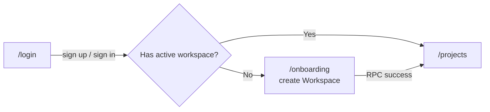
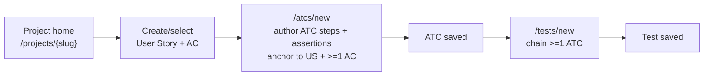
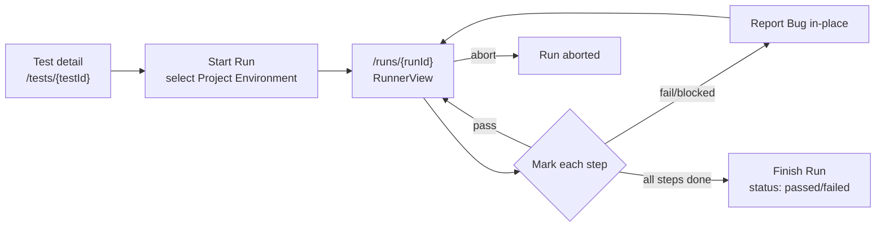
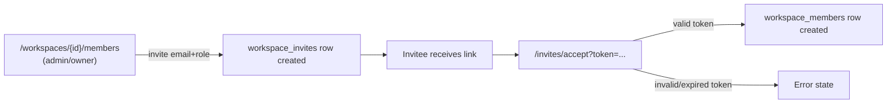
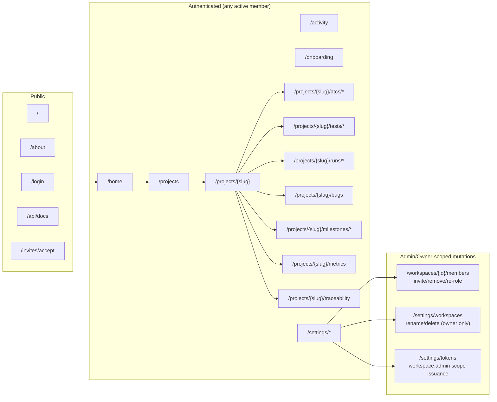

# User Journeys — Bunkai TMS

> Target repo: `upex-bunkai-tms`. Discovery scope: Phase 2 — PRD, sub-step 3.
> Generated: 2026-08-17.
> **Mindset**: routes are journey steps; redirects are transitions. Every step below cites a file. Steps that could not be cited to a file are flagged as gaps rather than guessed.

---

## 1. Route Map

### Public Routes (Unauthenticated)

| Route | Page | Purpose |
|---|---|---|
| `/` | `app/page.tsx` | Landing page |
| `/about` | `app/about/page.tsx` | Marketing/about page |
| `/login` | `app/(auth)/login/page.tsx` | Sign in / sign up entry point |
| `/auth/callback` | `app/auth/callback/` | Supabase auth callback (magic link / email confirm) |
| `/auth/oauth/[provider]` | `app/auth/oauth/[provider]/` | OAuth provider callback |
| `/invites/accept` | `app/invites/accept/page.tsx` | Invite-token redemption landing |
| `/api/docs` | `app/api/docs/page.tsx` | Public OpenAPI reference (Scalar) |
| `/qa` | `app/qa/page.tsx` | (Purpose not independently confirmed in this pass — Discovery Gap; name suggests an internal QA-facing page, not verified) |
| `/design-tokens` | `app/design-tokens/page.tsx` | Design-system token reference page |

Confirmed public via `middleware.ts:11` (`PUBLIC_PREFIXES = ['/login', '/auth', '/api/auth']`). Routes not listed in `PROTECTED_PREFIXES` (`middleware.ts:10`) and not matched by the middleware's negative-lookahead matcher are implicitly reachable without a session — `/`, `/about`, `/invites/accept`, `/api/docs`, `/qa`, `/design-tokens` all fall outside `PROTECTED_PREFIXES`.

### Protected Routes (Authenticated)

Gate: `middleware.ts:10,13-15,50-54` — any path under `PROTECTED_PREFIXES = ['/home', '/projects', '/onboarding', '/settings', '/activity']` redirects unauthenticated requests to `/login?next=<original path>`.

| Route | Page | Requires (role) | Purpose |
|---|---|---|---|
| `/home` | `app/(app)/home/page.tsx` | Any active membership | Dashboard / welcome |
| `/activity` | `app/(app)/activity/page.tsx` | Any active membership | Workspace audit/activity feed |
| `/onboarding` | `app/(app)/onboarding/page.tsx` | Signed in, no workspace yet | Create first Workspace |
| `/projects` | `app/(app)/projects/page.tsx` | Any active membership | List Projects in active Workspace |
| `/projects/new` | `app/(app)/projects/new/page.tsx` | `member`+ (implied by write-role RLS on `projects` insert) | Create a Project |
| `/projects/[projectSlug]` | `app/(app)/projects/[projectSlug]/page.tsx` | Any active membership (read); `member`+ to mutate | Project home / ATC explorer |
| `/projects/[projectSlug]/atcs/new` | `.../atcs/new/page.tsx` | `member`+ | Create an ATC |
| `/projects/[projectSlug]/atcs/[atcId]` | `.../atcs/[atcId]/page.tsx` | Any active membership (read); `member`+ to edit | View/edit one ATC |
| `/projects/[projectSlug]/tests/new` | `.../tests/new/page.tsx` | `member`+ | Build a Test chain |
| `/projects/[projectSlug]/tests/[testId]` | `.../tests/[testId]/page.tsx` | Any active membership | Test detail |
| `/projects/[projectSlug]/tests/[testId]/runs` | `.../tests/[testId]/runs/page.tsx` | Any active membership | Run history for one Test |
| `/projects/[projectSlug]/runs` | `.../runs/page.tsx` | Any active membership | Project-wide Run history |
| `/projects/[projectSlug]/runs/[runId]` | `.../runs/[runId]/page.tsx` | Any active membership (read); `member`+ to mark steps | Run execution / report |
| `/projects/[projectSlug]/bugs` | `.../bugs/page.tsx` | Any active membership | Bug list |
| `/projects/[projectSlug]/milestones` | `.../milestones/page.tsx` | Any active membership | Milestone list |
| `/projects/[projectSlug]/milestones/[milestoneId]` | `.../milestones/[milestoneId]/page.tsx` | Any active membership (read); `member`+ to edit — enforced explicitly at `milestones/[milestoneId]/page.tsx:54` | Milestone detail |
| `/projects/[projectSlug]/metrics` | `.../metrics/page.tsx` | Any active membership | Coverage/defect metrics dashboards |
| `/projects/[projectSlug]/traceability` | `.../traceability/page.tsx` | Any active membership | US ↔ AC ↔ ATC ↔ Test traceability chain view |
| `/settings` | `app/(app)/settings/page.tsx` | Any active membership | Settings index |
| `/settings/account` | `.../settings/account/page.tsx` | Any active membership | Personal identity/account |
| `/settings/notifications` | `.../settings/notifications/page.tsx` | Any active membership | Notification preferences |
| `/settings/tokens` | `.../settings/tokens/page.tsx` | Any active membership (own tokens); `admin`+ for `workspace:admin`-scoped tokens | Personal Access Token management |
| `/settings/workspaces` | `.../settings/workspaces/page.tsx` | Any active membership (view); `owner` to rename/delete | Workspace settings |
| `/workspaces/[id]/members` | `app/(app)/workspaces/[id]/members/page.tsx` | Any active membership (view); `admin`+ to invite/remove/re-role — RLS `workspace_members_insert_admin` etc., `supabase/migrations/0001_tenancy.sql:134-145` | Members & invites management |

### Dynamic Routes

| Pattern | Example | Purpose |
|---|---|---|
| `/projects/[projectSlug]` | `/projects/bunkai-web` | One Project, addressed by its unique-per-workspace slug |
| `/projects/[projectSlug]/atcs/[atcId]` | `/projects/bunkai-web/atcs/9c1e...` | One ATC by id |
| `/projects/[projectSlug]/tests/[testId]` | `/projects/bunkai-web/tests/71ab...` | One Test by id |
| `/projects/[projectSlug]/runs/[runId]` | `/projects/bunkai-web/runs/44f0...` | One Run by id |
| `/projects/[projectSlug]/milestones/[milestoneId]` | `/projects/bunkai-web/milestones/c2d1...` | One Milestone by id |
| `/workspaces/[id]/members` | `/workspaces/b1a2.../members` | Members page for one Workspace by id |
| `/auth/oauth/[provider]` | `/auth/oauth/google` | OAuth provider-specific callback |

---

## 2. Journey 1 — Sign up and create the first Workspace

- **Persona**: Workspace Owner (becomes owner by creating the workspace)
- **Goal**: Get from "no account" to "a working, populated Workspace"
- **Discovered From**: `middleware.ts`, `app/(auth)/login/page.tsx`, `app/(app)/onboarding/page.tsx`

### Flow Diagram

### Step-by-Step Flow

| Step | Page | Action | Next | Evidence |
|---|---|---|---|---|
| 1 | `/login` | Sign up or sign in via Supabase Auth | Redirect to `/projects` on success | `app/(auth)/login/page.tsx:24` |
| 2 | `/projects` (server) | Checks active workspace membership | `/onboarding` if none found | `app/(app)/onboarding/page.tsx:15-23` (the onboarding page itself performs this check and bounces back to `/projects` if a workspace already exists, confirming the inverse redirect happens from `/projects`) |
| 3 | `/onboarding` | User names/creates a Workspace via `OnboardingForm` | Redirect to `/projects` | `app/(app)/onboarding/page.tsx:26-29` (renders `OnboardingForm`); exact RPC not traced past the form boundary in this pass |
| 4 | `/projects` | Workspace now has ≥1 member (the creator, as `owner`) | User lands on Projects list | `workspaces.owner_user_id not null` — `supabase/migrations/0001_tenancy.sql:31` |

### Error Paths

| Error | Handling | Evidence |
|---|---|---|
| Unauthenticated request to any protected route | Redirect to `/login?next=<path>` | `middleware.ts:50-54` |
| Authenticated user with no workspace tries `/projects` directly | Not independently traced past step 2's onboarding-page self-check in this pass — the reverse direction (`/projects` → `/onboarding`) is plausible but unconfirmed. **Discovery Gap.** | — |

### Success Criteria

- [ ] New user reaches `/onboarding` automatically after first sign-in (no manual navigation).
- [ ] Submitting the onboarding form creates exactly one `workspaces` row with `owner_user_id` = the new user.
- [ ] A `workspace_members` row is created for that user with `role = 'owner'`.
- [ ] User lands on `/projects` afterward, not stuck on `/onboarding`.

---

## 3. Journey 2 — Author a User Story → ATC → Test chain

- **Persona**: QA Engineer (`member`)
- **Goal**: Turn a requirement into a reusable, executable Test
- **Discovered From**: `app/(app)/projects/[projectSlug]/atcs/new/page.tsx`, `app/(app)/projects/[projectSlug]/tests/new/page.tsx`, `lib/atcs/validation.ts`, `lib/tests/validation.ts`

### Flow Diagram

### Step-by-Step Flow

| Step | Page | Action | Next | Evidence |
|---|---|---|---|---|
| 1 | `/projects/[projectSlug]` | Navigate to a Module, view/create a User Story + Acceptance Criteria | Move to ATC authoring | `user_stories`/`acceptance_criteria` tables, `supabase/migrations/0003_authoring.sql` |
| 2 | `/projects/[projectSlug]/atcs/new` | Author ATC title, steps, assertions; must select ≥1 Acceptance Criterion | Blocked until valid, else saved | `lib/atcs/validation.ts:39,41` (`steps: ...min(1)`, `acceptance_criterion_ids: ...min(1)`) |
| 3 | (save) | `atcs` row created, anchored to `user_story_id` (FK, not null) | Redirect to ATC detail | `atcs.user_story_id not null references user_stories(id)` — `supabase/migrations/0004_atcs.sql:57` |
| 4 | `/projects/[projectSlug]/tests/new` | Select ≥1 existing ATC to chain into an ordered Test | Blocked until ≥1 ATC selected | `lib/tests/validation.ts:16` (`atc_ids: ...min(1)`) |
| 5 | (save) | `tests` + `test_steps` rows created, referencing (not copying) the chained ATCs | Redirect to Test detail | `test_steps.atc_id not null ... on delete restrict` — `supabase/migrations/0024_tests.sql:65` |

### Error Paths

| Error | Handling | Evidence |
|---|---|---|
| ATC step content is empty | 422 — Zod `min(1)` violation before any DB round-trip | `lib/atcs/validation.ts:24,30` |
| ATC content exceeds byte budget | 422 — `"Content must be at most {N} bytes."` | `lib/atcs/validation.ts:20` |
| ATC has zero linked Acceptance Criteria | 422 — Zod `min(1)` violation, backstopped at the RPC layer per BR-2 (Phase 1 `domain-glossary.md`) | `lib/atcs/validation.ts:41` |
| Test chain has zero ATCs | 422 — Zod `min(1)`, and RPC-level SQLSTATE `45120` as a second backstop | `lib/tests/validation.ts:16`; `supabase/migrations/0024_tests.sql:24-31` (per Phase 1 `domain-glossary.md` BR-3) |
| Test chain references an ATC from a different Workspace | RPC rejects with SQLSTATE `45122`, deliberately not disclosing which id was invalid ("INV-3 non-disclosure") | `supabase/migrations/0024_tests.sql:24-31` (per Phase 1 `domain-glossary.md` BR-3) |
| Test tag contains a comma | 422 — `"Tags must not contain commas."` | `lib/tests/validation.ts:78` |

### Success Criteria

- [ ] An ATC cannot be saved without a valid User Story anchor and ≥1 Acceptance Criterion.
- [ ] A Test cannot be saved with an empty ATC chain.
- [ ] Editing an already-chained ATC's steps is reflected in every Test that references it (no copy divergence) — per ADR-0009 (Phase 1 finding), not re-verified live in this pass.

---

## 4. Journey 3 — Execute a Run and file a Bug

- **Persona**: QA Engineer (`member`)
- **Goal**: Run a Test against an environment, mark step outcomes, and report a defect without leaving the runner
- **Discovered From**: `components/runs/RunnerView.tsx`, `lib/runs/mark-step-view.ts`, `lib/runs/report-bug-view.ts`, `app/api/v1/runs/[id]/steps/[stepId]/mark`

### Flow Diagram

### Step-by-Step Flow

| Step | Page | Action | Next | Evidence |
|---|---|---|---|---|
| 1 | `/projects/[projectSlug]/tests/[testId]` | Start a Run, selecting a `project_environments` target | `runs` row created, `status = 'running'` | `runs.status default 'running'` — `supabase/migrations/0031_runs.sql:79-80`; `lib/runs/start-run.test.ts` confirms a start-run code path exists |
| 2 | `/projects/[projectSlug]/runs/[runId]` | RunnerView renders the snapshot chain (`run_atcs`/`run_steps`) | User marks each step | `supabase/migrations/0031_runs.sql:120-170` (snapshot tables); `components/runs/RunnerView.tsx` |
| 3 | (per step) | Mark step pass/fail/blocked/skipped | `run_atcs.status` updates | `run_atcs.status` enum — `supabase/migrations/0031_runs.sql:126-127`; `lib/runs/mark-step-view.ts` |
| 4 | (on fail/blocked) | Report a Bug in-place, provenance-linked to this Run/Run Step/ATC | `bugs` row created with `run_id`/`run_step_id`/`atc_id` populated | `lib/runs/report-bug-view.ts`; `bugs` provenance columns — `supabase/migrations/0046_bugs.sql:93-103` |
| 5 | (all steps resolved) | Finish the Run | `runs.status` → `passed`/`failed` | `supabase/migrations/0031_runs.sql:79-80`; migration `0037_run_finish.sql` (dedicated finish-transition migration, per Phase 1 `domain-glossary.md`) |

### Error Paths

| Error | Handling | Evidence |
|---|---|---|
| Bug title outside 5–200 chars | 422 — `` `Title must be between ${BUG_TITLE_MIN} and ${BUG_TITLE_MAX} characters` `` | `lib/bugs/validation.ts:24` |
| Bug's provenance (`run_id`/`run_step_id`/`atc_id`) points outside the Bug's own Project | RPC rejects, SQLSTATE `45305`/`45306`/`45307` (per Phase 1 `domain-glossary.md` BR-4) | `supabase/migrations/0046_bugs.sql:38-87` |
| Run aborted mid-execution | `runs.status` → `aborted` (terminal, run-grain only — per Phase 1 glossary's "Run-status grain split" note) | `supabase/migrations/0031_runs.sql:79-80`; migration `0036_run_abort.sql` |
| Realtime channel drops mid-run | `RunnerView` reconciles on reconnect via a scheduled refetch (same pattern as `AppSidebar`'s notification channel) | `lib/runs/realtime-run-channel.ts`, mirrored pattern confirmed in `components/layout/AppSidebar.tsx:258-310` |

### Success Criteria

- [ ] Starting a Run snapshots the Test's current ATC chain — later edits to the source ATCs do not retroactively alter this Run's record.
- [ ] A Bug filed from within a Run always carries `run_id`, and its `project_id`/`module_id` cannot diverge from the Run's own Project.
- [ ] Run status only reaches a terminal value (`passed`/`failed`/`aborted`) once, matching the `runs.status` state machine (Phase 1 `domain-glossary.md`).

---

## 5. Journey 4 — Invite a teammate into the Workspace

- **Persona**: Workspace Admin / Owner (`admin`/`owner`) inviting; the invitee becomes whichever persona their assigned role implies
- **Goal**: Grow the team without the owner personally creating every account
- **Discovered From**: `app/(app)/workspaces/[id]/members/page.tsx`, `app/invites/accept/page.tsx`, `app/api/v1/invites/`, `app/api/v1/workspaces/[id]/invites/`

### Flow Diagram

### Step-by-Step Flow

| Step | Page | Action | Next | Evidence |
|---|---|---|---|---|
| 1 | `/workspaces/[id]/members` | Admin/owner submits an invite (email + role) | `workspace_invites` row created | `app/(app)/workspaces/[id]/members/page.tsx:26-27` (`select('id, email, role, expires_at, accepted_at, revoked_at, created_at')` from `workspace_invites`) |
| 2 | (external, email) | Invitee receives a link with `?token=` | Opens `/invites/accept?token=...` | `app/invites/accept/page.tsx:11-13` (reads `token`/`next` search params) |
| 3 | `/invites/accept` | `AcceptClient` calls `POST /api/v1/invites/accept`, then redirects | Redirect to `nextPath` (default `/projects`) | `app/invites/accept/page.tsx:16` (`nextPath={next ?? '/projects'}`) |
| 4 | (server) | On success, a `workspace_members` row is created for the invitee at the invited role | Invitee now sees the Workspace on next `/projects` load | `workspace_invites.role` column, same select above |

### Error Paths

| Error | Handling | Evidence |
|---|---|---|
| Invite token missing from URL | `AcceptClient` receives `token=''` — exact client-side handling not traced past the page boundary in this pass. **Discovery Gap.** | `app/invites/accept/page.tsx:13` |
| Invite expired (`workspace_invites.expires_at` passed) | Column exists to support this check; exact rejection message not traced in this pass. **Discovery Gap.** | `app/(app)/workspaces/[id]/members/page.tsx:27` (`expires_at` selected) |
| Invite already accepted/revoked (`accepted_at`/`revoked_at` set) | Columns exist to support idempotency/revocation; exact handling not traced in this pass. **Discovery Gap.** | same source |

### Success Criteria

- [ ] Only `admin`/`owner` can create an invite (RLS on `workspace_invites` insert — not independently re-read in this pass beyond the members page query; inherits the same `admin`+`owner` pattern as `workspace_members` mutations per `supabase/migrations/0001_tenancy.sql:134-145`).
- [ ] Accepting a valid, unexpired, unrevoked invite creates exactly one `workspace_members` row at the invited role.
- [ ] An expired or already-accepted invite cannot be redeemed twice.

---

## 6. Navigation Structure

Note: all "Authenticated" routes are reachable by every active member regardless of role (`viewer` included) — the role gate is on *mutation*, not route access, except `/onboarding` (only reachable pre-workspace) and the "Admin/Owner-scoped mutations" subgraph, whose *pages* are reachable by any member but whose *write actions* are gated server-side.

---

## 7. Breadcrumb Patterns

| Path | Breadcrumb |
|---|---|
| `/projects/{slug}` | `{Workspace Name} > {Project Name} > All ATCs` |
| `/projects/{slug}/runs` | `{Workspace Name} > {Project Name} > Test Runs` |
| `/projects/{slug}/bugs` | `{Workspace Name} > {Project Name} > Bug Reports` |
| `/projects/{slug}/metrics` | `{Workspace Name} > {Project Name} > Metrics` |
| `/projects/{slug}/traceability` | `{Workspace Name} > {Project Name} > Traceability` |
| `/projects/{slug}/milestones` | `{Workspace Name} > {Project Name} > Milestones` |

Evidence: `Breadcrumb items={[workspaceName, projectName, sectionLabel]}` — `app/(app)/projects/[projectSlug]/project-shell.tsx:85`, where `sectionLabel` is resolved by `resolveProjectSectionLabel()` in `project-sub-nav.tsx:73-76`, which maps the current pathname to the matching `ProjectSubNav` entry label (`"All ATCs"`, `"Test Runs"`, `"Bug Reports"`, `"Metrics"`, `"Traceability"`, `"Milestones"` — `project-sub-nav.tsx:44-51`). This 3-level breadcrumb (Workspace > Project > Section) is the canonical nesting model for project-scoped routes, confirming Project sits directly under Workspace with Module/ATC/Test/Run detail views not represented as their own breadcrumb level.

---

## 8. Critical Paths

### Happy Paths (Must Work)

| Journey | Start | End | Business Impact |
|---|---|---|---|
| Sign up → Workspace created | `/login` | `/projects` with 1 workspace, caller = `owner` | No workspace = no product usage at all; this is the activation gate |
| Author ATC → chain into Test | `/atcs/new` | Test saved with ≥1 ATC | This is Bunkai's core differentiator (structural traceability) — if broken, the product's entire value proposition fails |
| Execute a Run → mark all steps → finish | `/runs/{runId}` | `runs.status = 'passed'` or `'failed'` | The entire manual-QA value loop depends on this completing cleanly |
| File a Bug from a failed Run step | Runner, mid-execution | `bugs` row with correct provenance | Native defect management is a named differentiator; broken provenance defeats it |
| Invite → accept → new member can work | `/workspaces/{id}/members` | New `workspace_members` row at correct role | Team growth path; broken invite flow blocks onboarding new QA hires |

### Unhappy Paths (Must Handle)

| Scenario | Expected Behavior | Evidence |
|---|---|---|
| `viewer` attempts any write action | Rejected at RLS (and, where checked, at the UI `canEdit` gate) | `supabase/migrations/0005_rls_helpers.sql:35-50`; `milestones/[milestoneId]/page.tsx:54` |
| ATC saved with zero Acceptance Criteria | Rejected client-side (Zod `min(1)`) and server-side (RPC, per BR-2) | `lib/atcs/validation.ts:41` |
| Test chain references a cross-workspace ATC | Rejected with non-disclosing error (SQLSTATE `45122`) | `supabase/migrations/0024_tests.sql:24-31` |
| Bug provenance points outside its own Project | Rejected (SQLSTATE `45305`-`45307`) | `supabase/migrations/0046_bugs.sql:38-87` |
| Non-admin/owner attempts to issue a `workspace:admin` PAT | Rejected — `"Only workspace admins or owners can issue workspace:admin tokens."` | `lib/api/pat.ts:86` |
| Unauthenticated request to any protected route | Redirect to `/login?next=<path>` | `middleware.ts:50-54` |
| Sole owner tries to leave/downgrade | Guarded by `isSoleOwner` computed flag | `lib/account/workspaces.ts:91` |

---

## 9. Discovery Gaps

| Flow | Unknown | Question |
|---|---|---|
| `/qa` route purpose | Route exists (`app/qa/page.tsx` + `_components`/`_lib` subfolders) but its purpose was not read in this pass | Read `app/qa/page.tsx` directly in a follow-up session |
| Invite expiry/revocation exact UX | `workspace_invites.expires_at`/`accepted_at`/`revoked_at` columns exist; exact error copy/handling on `/invites/accept` for each case not traced | Read `app/invites/accept/accept-client.tsx` and `app/api/v1/invites/accept/route.ts` directly |
| `/projects` → `/onboarding` redirect direction | Confirmed the reverse (`/onboarding` → `/projects` when a workspace exists); the forward direction was not independently re-read in this pass, only inferred from the onboarding page's own comment | Read `app/(app)/projects/page.tsx` directly |
| Agentic/CI Run creation UI | `runs.executor_mode` supports `'agent'`/`'ci'` at the schema level; no UI route was found that creates a non-`human` Run — likely API-only (PAT-authenticated `POST /api/v1/runs`) | Confirm via `app/api/v1/runs/route.ts` request-body handling for `executor_mode` |
| 2FA/OTP steps | None found in this pass (Supabase Auth cookie session + PAT are the two auth surfaces observed) | Not mapped per this doctrine's explicit exclusion rule for un-received external-dependency steps |

---

## 10. QA Relevance

### Critical E2E Test Scenarios

| Priority | Scenario | Journey Reference |
|---|---|---|
| P0 | Sign up → create Workspace → land on `/projects` as owner | Journey 1 |
| P0 | Author User Story + AC → ATC (anchored) → Test (chained) → save succeeds | Journey 2 |
| P0 | Start a Run → mark all steps → Run reaches a terminal status | Journey 3 |
| P0 | `viewer` cannot perform any write action across ATC/Test/Run/Bug/Milestone | Journey 2, 3; Permission Matrix (`user-personas.md` §7) |
| P1 | File a Bug from a failed Run step with correct provenance (`run_id`/`run_step_id`/`atc_id`) | Journey 3 |
| P1 | Invite a teammate → accept → new member appears with correct role | Journey 4 |
| P1 | Cross-workspace ATC injection into a Test chain is rejected | Journey 2 |
| P2 | Non-admin/owner PAT `workspace:admin` issuance is rejected | Journey 4 (adjacent — token issuance, not invite) |
| P2 | Sole-owner leave/downgrade is blocked | Journey 1 (adjacent) |

### Suggested Test Data

| Journey | Test User | Prerequisites |
|---|---|---|
| Journey 1 (Signup) | Fresh, never-before-seen email | None — this is the zero-state path |
| Journey 2 (Author) | `member`-role test account (needs creation — see `user-personas.md` §9 gap) | An existing Project + Module + User Story with ≥1 Acceptance Criterion |
| Journey 3 (Execute) | `member`-role test account | An existing Test with ≥1 ATC, and ≥1 `project_environments` row seeded |
| Journey 4 (Invite) | `admin`- or `owner`-role test account (both need creation) inviting a fresh email | An existing Workspace with the inviter as an active admin/owner member |
