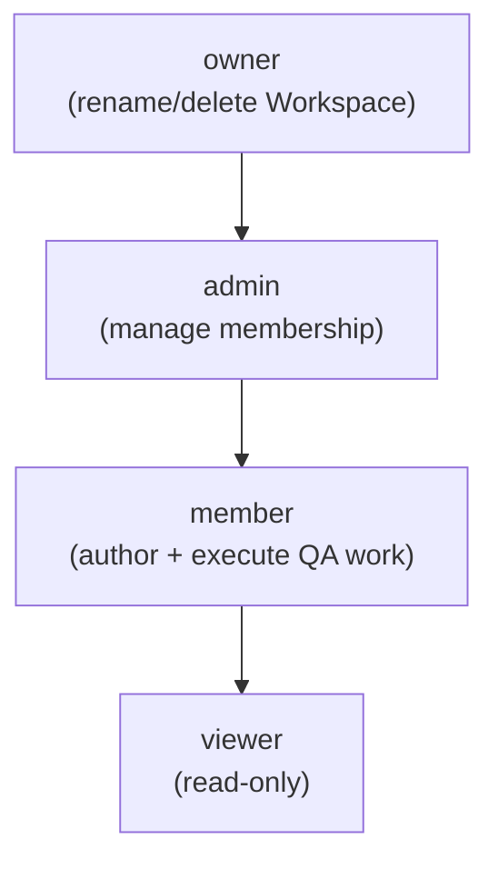

# User Personas — Bunkai TMS

> Target repo: `upex-bunkai-tms`. Discovery scope: Phase 2 — PRD, sub-step 2.
> Generated: 2026-08-17.
> **Mindset**: personas are the roles the system already recognizes, not researched demographic archetypes. All four personas below map 1:1 to `workspace_members.role` values — Found in: `upex-bunkai-tms/supabase/migrations/0001_tenancy.sql:43-44` (`check (role in ('viewer','member','admin','owner'))`). The target repo's own PRD names narrative personas (Elena, Mateo, Sara, Karim) — those names are **not used here** because they are documentation constructs, not code-enforced roles (Phase 1's `business-model.md` already flagged this at Low-Medium confidence). Where useful, this doc notes the rough correspondence without adopting the names as fact.

---

## 1. Persona Discovery Summary

| Persona | System Role | Access Level | Primary Goal |
|---|---|---|---|
| Read-Only Reviewer | `viewer` | Read-only across all workspace data | See test coverage, run results, and bug status without changing anything |
| QA Engineer | `member` | Full CRUD on test-authoring + execution entities | Author ATCs, chain Tests, execute Runs, file Bugs |
| Workspace Admin | `admin` | Everything `member` can do, plus manage membership | Grow/manage the team: invite, remove, re-role members |
| Workspace Owner | `owner` | Everything `admin` can do, plus own the Workspace itself | Control the Workspace's existence and top-level settings |

A fifth, structurally distinct actor class — the **headless/API caller (Personal Access Token)** — is documented separately in §7, because it is not gated by `workspace_members.role` but by its own `access_tokens.scopes[]` model.

---

## 2. Persona: Read-Only Reviewer (`viewer`)

### Identity

- **System Role**: `viewer` (`workspace_members.role = 'viewer'`)
- **Evidence file**: `upex-bunkai-tms/supabase/migrations/0001_tenancy.sql:43-44` (role enum); `upex-bunkai-tms/supabase/migrations/0005_rls_helpers.sql:19-33` (`bunkai_is_workspace_member` — the SELECT-only gate every `viewer` passes)
- **Access Level**: Read-only. Can see everything an active member of the workspace can see; cannot mutate anything.
- **Estimated % of Users**: Unknown — no usage telemetry exists (see `executive-summary.md` §3). Not fabricated; left as Discovery Gap.

### Goals (Inferred from Features)

| Goal | Supporting Feature | Route/Component |
|---|---|---|
| Check what a sprint/story covers without risk of accidental edits | Traceability chain view | `app/(app)/projects/[projectSlug]/traceability/page.tsx` |
| Monitor test execution health | Run history, project metrics | `app/(app)/projects/[projectSlug]/runs/page.tsx`, `app/(app)/projects/[projectSlug]/metrics/page.tsx` |
| Track open defects | Bug list | `app/(app)/projects/[projectSlug]/bugs/page.tsx` |

### Pain Points (Inferred from Validation/Errors)

| Pain Point | Evidence |
|---|---|
| Cannot edit a Milestone even when they can see it needs updating | UI copy: "Editing requires the member role or higher." — `upex-bunkai-tms/components/milestones/MilestoneDetailView.tsx:76` |
| Cannot write to any RLS-protected write path (ATC, Test, Bug, etc.) | `bunkai_can_write_workspace()` requires `role in ('member','admin','owner')` — `viewer` is deliberately excluded — `upex-bunkai-tms/supabase/migrations/0005_rls_helpers.sql:35-50` |

### Feature Access

| Feature | Access | Evidence |
|---|---|---|
| ATC library (browse) | Full | `atcs_select_workspace_member` RLS policy — `supabase/migrations/0005_rls_helpers.sql:346` |
| ATC authoring (create/edit) | None | `atcs_insert_workspace_role_member_plus` requires `member+` — `supabase/migrations/0005_rls_helpers.sql:356` |
| Run execution (start/mark steps) | None | Runner mutations gated the same way as write paths generally (role `member`+) |
| Milestone edit | None | Explicit UI gate, `canEdit = ['member','admin','owner'].includes(role)` — `app/(app)/projects/[projectSlug]/milestones/[milestoneId]/page.tsx:54` |
| Workspace membership management | None | Admin/owner-only (see Workspace Admin persona) |

### User Journey Summary

`Login → Projects → open a Project → browse ATCs/Runs/Bugs/Traceability (read-only)`

### Profile Attributes

From `workspace_members`: `user_id`, `role = 'viewer'`, `status`, `joined_at`. No separate "viewer profile" fields exist beyond the shared `workspace_members` row — Found in: `upex-bunkai-tms/supabase/migrations/0001_tenancy.sql:40-49`.

### Representative Quote (inferred)

> "I just need to see if this feature has test coverage before I sign off — I don't need to touch anything." (inferred — not sourced from user research; illustrative only)

---

## 3. Persona: QA Engineer (`member`)

### Identity

- **System Role**: `member` (`workspace_members.role = 'member'`, also the schema default — `upex-bunkai-tms/supabase/migrations/0001_tenancy.sql:43`)
- **Evidence file**: `upex-bunkai-tms/supabase/migrations/0005_rls_helpers.sql:35-50` (`bunkai_can_write_workspace`)
- **Access Level**: Full CRUD on Projects, Modules, User Stories, Acceptance Criteria, ATCs, Tests, Runs, Bugs, Milestones. No workspace-membership or workspace-identity control.
- **Estimated % of Users**: Unknown (Discovery Gap — no telemetry). Structurally this is the schema default role for new members, suggesting it is intended as the majority role.

### Goals (Inferred from Features)

| Goal | Supporting Feature | Route/Component |
|---|---|---|
| Build a reusable ATC library anchored to real requirements | ATC editor + anchoring panel | `components/atcs/AtcEditor.tsx`, `components/atcs/AnchoringPanel.tsx`, `app/(app)/projects/[projectSlug]/atcs/new/page.tsx` |
| Chain ATCs into an executable Test | Test builder | `components/tests/`, `app/(app)/projects/[projectSlug]/tests/new/page.tsx` |
| Execute a Test and record results | Manual Run execution | `components/runs/RunnerView.tsx`, `app/api/v1/runs/[id]/steps/[stepId]/mark` |
| File a defect without leaving the run | In-place bug reporting | `lib/runs/report-bug-view.ts`, `components/bugs/` |

### Pain Points (Inferred from Validation/Errors)

| Pain Point | Evidence |
|---|---|
| Cannot create an ATC without linking ≥1 Acceptance Criterion | `acceptance_criterion_ids: z.array(z.string().uuid()).min(1)` — `upex-bunkai-tms/lib/atcs/validation.ts:41` |
| Cannot create an ATC with an empty step or over-budget content | `content: z.string().min(1)...` + `"Content must be at most {N} bytes."` — `upex-bunkai-tms/lib/atcs/validation.ts:20,24` |
| Cannot create a Test with zero ATCs | `atc_ids: z.array(z.string().uuid()).min(1)` — `upex-bunkai-tms/lib/tests/validation.ts:16` |
| Cannot tag a Test with a comma-containing tag | `"Tags must not contain commas."` — `upex-bunkai-tms/lib/tests/validation.ts:78` |
| Cannot title a Bug outside the allowed length band | `` `Title must be between ${BUG_TITLE_MIN} and ${BUG_TITLE_MAX} characters` `` — `upex-bunkai-tms/lib/bugs/validation.ts:24` |

### Feature Access

| Feature | Access | Evidence |
|---|---|---|
| ATC/Test/User Story/AC authoring | Full | `*_insert_workspace_role_member_plus` / `*_update_...` RLS policies, `role in ('member','admin','owner')` — `supabase/migrations/0005_rls_helpers.sql` (repeated pattern across entities) |
| Run execution | Full | Same write-role gate |
| Bug filing/triage | Full | Same write-role gate; `bugs` table write path — `supabase/migrations/0046_bugs.sql` |
| Workspace membership management | None | Admin/owner-only |
| Workspace deletion/rename | None | Owner-only |

### User Journey Summary

`Login → Project → author Module/US/AC/ATC → chain a Test → start a Run → mark steps → (optionally) file a Bug → Run finishes`

### Profile Attributes

`workspace_members.role = 'member'`, `status`, `joined_at`. No dedicated QA-specific profile fields beyond membership row.

### Representative Quote (inferred)

> "I want to write a test once and never have to remember to update it in five other places when the flow changes." (inferred — illustrative only)

---

## 4. Persona: Workspace Admin (`admin`)

### Identity

- **System Role**: `admin` (`workspace_members.role = 'admin'`)
- **Evidence file**: `upex-bunkai-tms/supabase/migrations/0001_tenancy.sql:134-145` (`workspace_members_insert_admin` / `_update_admin` / `_delete_admin` policies, `role in ('admin','owner')`)
- **Access Level**: Everything `member` can do, plus manage workspace membership (invite, remove, change another member's role) and issue workspace-scoped `workspace:admin`-level Personal Access Tokens.
- **Estimated % of Users**: Unknown (Discovery Gap).

### Goals (Inferred from Features)

| Goal | Supporting Feature | Route/Component |
|---|---|---|
| Invite new teammates and assign their starting role | Members & invites page | `app/(app)/workspaces/[id]/members/page.tsx`, `app/api/v1/workspaces/[id]/invites/` |
| Remove or re-role a member | Member management actions | `app/api/v1/workspaces/[id]/membership` |
| Issue an admin-scoped PAT for a trusted automation | Token issuance with `workspace:admin` scope | `app/api/v1/tokens/`, `upex-bunkai-tms/lib/api/pat.ts:49-90` |

### Pain Points (Inferred from Validation/Errors)

| Pain Point | Evidence |
|---|---|
| Cannot issue a `workspace:admin` PAT without an explicit `workspace_id` | `"workspace:admin tokens must target a specific workspace (workspace_id required)."` — `upex-bunkai-tms/lib/api/pat.ts:59` |
| Non-admin/owner members cannot self-elevate via token issuance | `"Only workspace admins or owners can issue workspace:admin tokens."` — `upex-bunkai-tms/lib/api/pat.ts:86` (this exact rule was the fix for a real production incident — BK-135, see Risk Areas in `executive-summary.md`) |

### Feature Access

| Feature | Access | Evidence |
|---|---|---|
| All `member` features | Full | Inherits the `member+` write gate |
| Workspace membership (invite/remove/re-role) | Full | Admin+owner-only RLS policies (§ above) |
| Workspace settings (rename, delete) | None | Owner-only (`workspaces_update_owner`, `workspaces_delete_owner`) |

### User Journey Summary

`Login → Settings → Workspaces/Members → invite teammate by email + role → teammate accepts → membership row created`

### Profile Attributes

`workspace_members.role = 'admin'`, `status`, `joined_at`.

### Representative Quote (inferred)

> "I need to onboard three new testers this sprint without asking the workspace owner to do it for me." (inferred — illustrative only)

---

## 5. Persona: Workspace Owner (`owner`)

### Identity

- **System Role**: `owner` (`workspace_members.role = 'owner'`)
- **Evidence file**: `upex-bunkai-tms/supabase/migrations/0001_tenancy.sql:111-128` (`workspaces_update_owner`, `workspaces_delete_owner`, both `role = 'owner'`)
- **Access Level**: Everything `admin` can do, plus rename/delete the Workspace itself. `workspaces.owner_user_id` also names a single canonical owner at creation time — Found in: `upex-bunkai-tms/supabase/migrations/0001_tenancy.sql:31`.
- **Estimated % of Users**: Structurally the smallest cohort — typically the workspace creator. Not measured (Discovery Gap).

### Goals (Inferred from Features)

| Goal | Supporting Feature | Route/Component |
|---|---|---|
| Create the Workspace at signup/onboarding time | Onboarding flow | `app/(app)/onboarding/page.tsx`, `onboarding-form` client component |
| Retain sole control over Workspace-level destructive actions | Workspace settings | `app/(app)/settings/workspaces/page.tsx` |
| Prevent a workspace from being left ownerless | `isSoleOwner` guard | `upex-bunkai-tms/lib/account/workspaces.ts:91` (`isSoleOwner: role === 'owner' && ownerCounts[...] === 1`) |

### Pain Points (Inferred from Validation/Errors)

| Pain Point | Evidence |
|---|---|
| Must remain aware of "sole owner" status before demoting/leaving | `isSoleOwner` computed guard exists specifically to flag this state — `upex-bunkai-tms/lib/account/workspaces.ts:91` |

### Feature Access

| Feature | Access | Evidence |
|---|---|---|
| All `admin` features | Full | Inherits admin+owner gates |
| Workspace rename/delete | Full | `workspaces_update_owner` / `workspaces_delete_owner` — owner-only |

### User Journey Summary

`Sign up → Onboarding (create Workspace) → becomes sole owner → invite Admins/Members over time`

### Profile Attributes

`workspace_members.role = 'owner'`; also referenced directly by `workspaces.owner_user_id`.

### Representative Quote (inferred)

> "This is our team's workspace — I'm the one who's accountable if it needs to be renamed, transferred, or shut down." (inferred — illustrative only)

---

## 6. Role Hierarchy

Each level is additive (a strict superset of the level below), per the RLS policies cited in each persona section above — there is no lateral or non-linear permission branch observed in the schema.

---

## 7. Permission Matrix

| Permission | viewer | member | admin | owner |
|---|---|---|---|---|
| View Projects/Modules/ATCs/Tests/Runs/Bugs | Yes | Yes | Yes | Yes |
| Create/edit ATCs, Tests, User Stories, ACs | No | Yes | Yes | Yes |
| Execute Runs, mark steps | No | Yes | Yes | Yes |
| File/triage Bugs | No | Yes | Yes | Yes |
| Edit Milestones | No | Yes | Yes | Yes |
| Invite/remove/re-role workspace members | No | No | Yes | Yes |
| Issue a `workspace:admin`-scoped PAT | No | No | Yes | Yes |
| Rename/delete the Workspace | No | No | No | Yes |

Source for every row: RLS policies in `upex-bunkai-tms/supabase/migrations/0001_tenancy.sql` and `0005_rls_helpers.sql`, cross-checked against the UI-level `canEdit` gate in `milestones/[milestoneId]/page.tsx:54` and the PAT admin-scope guard in `lib/api/pat.ts:49-90`.

---

## 8. Discovery Gaps

| Gap | Why It Matters | Question to Ask |
|---|---|---|
| No user-count/role-distribution telemetry | Cannot state which persona is actually most common in practice | Ask the product owner, or query `workspace_members` directly via `[DB_TOOL]` in a later session |
| No dedicated "Developer" role distinct from `member`/`viewer` | The target's own narrative PRD names a "Sara, developer" persona; the schema has no role called "developer" | Confirm with product owner whether developers are expected to use `viewer` (read status) or `member` (edit) in practice |
| Full permitted Bug status transition table not independently verified (only the raw CHECK constraint was read) | A persona's "Pain Points" around bug triage could be incomplete if some transitions are actually blocked | Read `lib/bugs/transition-bug-status-isolation.test.ts` in a later session |
| Whether `admin` can also issue non-`workspace:admin`-scoped PATs on behalf of other members | Feature Access table above assumes admin PAT issuance is limited to `workspace:admin` scope; other scopes' issuance rules not fully traced | Read the full `POST /api/v1/tokens` handler, not just `pat.ts`'s exported guards |

---

## 9. QA Relevance

### Test Account Requirements

| Persona | Test Account | Permissions Needed |
|---|---|---|
| Read-Only Reviewer | Not present in `.env.example` — **needs creation** | `workspace_members.role = 'viewer'` in a test workspace |
| QA Engineer | `QA_E2E_USER_EMAIL` / `QA_E2E_USER_PASSWORD` exist in `upex-bunkai-tms/.env.example`, but role is not encoded in the var name — **cannot confirm this account's role without live DB access** | `role = 'member'` (assumed default, not verified) |
| Workspace Admin | Not present in `.env.example` — **needs creation** | `role = 'admin'` in a test workspace |
| Workspace Owner | Not present in `.env.example` — **needs creation** | `role = 'owner'` in a test workspace (likely the workspace creator by default) |

This repo's own convention (`LOCAL_<ROLE>_EMAIL` / `STAGING_<ROLE>_EMAIL`, per this repo's `CLAUDE.md` §1) has no counterpart in the target repo today — only a single undifferentiated `QA_E2E_USER_*` pair exists. **Flagged, not assumed**: per-role test accounts likely need to be provisioned before role-based automated testing (`/adapt-framework`, `/test-automation`) can proceed.

### Critical Persona Flows to Test

- `viewer` attempting a write action on every mutable entity (ATC, Test, Run, Bug, Milestone, workspace membership) — expect uniform denial.
- `member` attempting workspace-membership mutation or workspace rename/delete — expect denial.
- `admin` attempting workspace rename/delete — expect denial (owner-only).
- `admin` issuing a `workspace:admin`-scoped PAT for themselves vs. for a `member` — the second should be rejected per `lib/api/pat.ts:86`.
- Sole-owner demotion/removal — `isSoleOwner` guard should block leaving a workspace ownerless.

### Edge Cases by Persona

- **viewer**: role changed to `member` mid-session — does the UI's `canEdit` gate reflect the change on next navigation, or does the client hold a stale role? (Not traced in this pass — Discovery Gap.)
- **member**: attempts to delete a User Story that still has ATCs anchored to it — expect `on delete restrict` rejection (BR from Phase 1 `domain-glossary.md`).
- **admin**: last remaining admin is removed by an owner while other `member`s remain — workspace has no admin; is this blocked or allowed? (Not traced — Discovery Gap.)
- **owner**: sole owner tries to leave/downgrade their own role — `isSoleOwner` exists specifically to guard this case (`lib/account/workspaces.ts:91`).

---

## Supplementary: Non-Human Actor — API / Headless Caller (PAT)

Not counted among the four core personas above (it is not a `workspace_members.role` value), but structurally real and worth surfacing for QA: any caller authenticated via a Personal Access Token — a CI pipeline, a script, or an AI agent — operates under a **scope model**, not a role.

- **Scopes**: `atc:read`, `atc:write`, `run:execute`, `workspace:admin` — Found in: `upex-bunkai-tms/lib/api/pat.ts:12-18`.
- **Corresponding Run field**: `runs.executor_mode in ('agent','ci')` — Found in: `upex-bunkai-tms/supabase/migrations/0031_runs.sql:81`.
- **Confidence**: High that the mechanism exists and is enforced (PAT issuance, scope-checking guards, and a documented remediated privilege-escalation bug all confirm it is live code, not aspirational). **Low-Medium** on whether a full `agent`/`ci` Run execution flow is reachable end-to-end via this token — only the token-issuance and scope-guard code was traced in this pass, not a full non-human Run creation flow.
- The target's own PRD names this actor "Karim, an autonomous AI test agent" — a narrative label, not a code-level role; not adopted here per the same reasoning as the other three narrative persona names.
