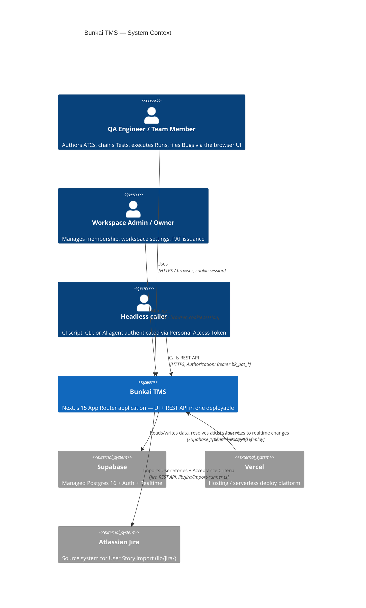
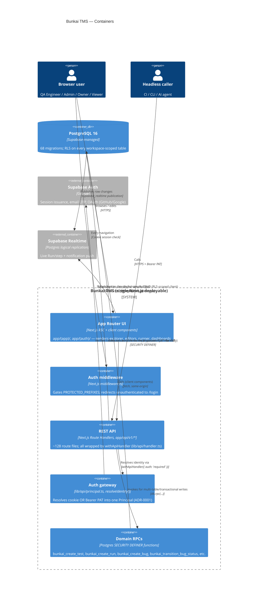
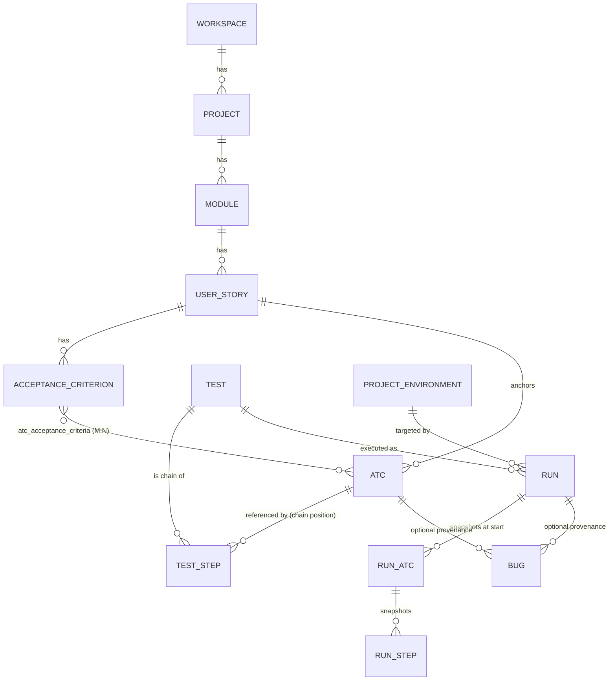

# Architecture Specification — Bunkai TMS

> Target repo: `upex-bunkai-tms`. Discovery scope: Phase 2 — SRS, sub-step 1 (`/project-discovery`, run from `qa-engineering-bunkai`).
> Generated: 2026-08-17.
> **Mindset**: this document describes the system AS SHIPPED, derived independently from source code (migrations, route files, ADRs, `package.json`). The target repo's own `.context/SRS/architecture-specs.md` was read as an accelerant but is treated as **planning narrative, not current fact** — see "Note on the target's own architecture-specs.md" below. Every claim here is either evidenced with a file path or listed under Discovery Gaps.

---

## Note on the target's own `architecture-specs.md`

`upex-bunkai-tms/.context/SRS/architecture-specs.md` describes a "Bunkai Cloud" edition with Cloudflare R2, Sentry, PostHog, GitHub Actions CI, a self-hosted "Bunkai Community" Phase-2 edition (Docker Compose, MinIO, Better Auth), an `integrations` table, a `feature_flags` table, an `environments` table, and CSP/rate-limit numbers. **None of these are independently verifiable in the current codebase**, and several are directly contradicted:

| Target's own doc claims | Independently verified reality |
|---|---|
| Cloudflare R2 for evidence blobs | No `@aws-sdk/*`/R2/S3 client dependency in `package.json`; `bugs.evidence_urls` (per domain-glossary) is a plain text-url array, no upload pipeline traced |
| Sentry + PostHog | No `@sentry/*` or `posthog-js` dependency in `package.json` (confirmed Phase 1) |
| GitHub Actions CI/CD | No `.github/workflows/` directory exists (confirmed Phase 1) |
| `integrations`, `feature_flags`, `environments` tables | Actual migrations name the table `project_environments` (`0031_runs.sql`), not `environments`; no `integrations` or `feature_flags` table exists in any of the 68 migration files |
| CSP `script-src 'self'` + nonces | `next.config.ts` has no `headers()` function; no CSP configured anywhere found |
| Self-hosted "Community" edition (Docker, MinIO, Better Auth) | No `docker-compose.yml`, no MinIO/Better-Auth dependency — this is unbuilt roadmap narrative |

This document therefore does **not** reuse the target's own architecture-specs.md content. It rebuilds the architecture picture from migrations, ADRs, and route/middleware code. Where the target's planning doc is directionally useful (e.g. naming Vercel/Supabase as the platform), it is cited but re-verified.

---

## 1. System Overview

**Pattern**: Modular monolith — a single Next.js 15 (App Router) application serves both the UI (React Server Components + client components) and the REST API (`app/api/v1/*` Route Handlers), backed by a single Supabase (PostgreSQL 16) project. There is no separate backend service, no microservices, no message queue. Found in: `upex-bunkai-tms/package.json` (`next`, `react`, `react-dom`), `upex-bunkai-tms/app/api/v1/` (128 route files, confirmed by directory listing), `upex-bunkai-tms/.agents/project.yaml` (single `db_project_ref` across environments, Phase 1 finding).

### Tech stack table

| Layer | Technology | Evidence |
|---|---|---|
| Frontend framework | Next.js `^15` (App Router, RSC), React `^19` | `package.json` |
| Language | TypeScript `^5.9.3`, strict mode | `tsconfig.json` |
| Styling / components | Tailwind CSS `^3.4`, Radix UI, `shadcn/ui`-style (`components.json`), `cmdk`, `@monaco-editor/react`, `@tanstack/react-table`, `@dnd-kit/*` | `package.json` |
| Markdown | `react-markdown` + `remark-gfm` + `rehype-sanitize` (sanitized render pipeline) | `package.json` |
| API | Next.js Route Handlers under `app/api/v1/*`, no separate framework | `app/api/v1/` directory listing (128 route files across ~35 resource groups) |
| Validation | Zod `^4.4.3` schemas per domain (`lib/*/validation.ts`) | e.g. `lib/atcs/validation.ts`, `lib/tests/validation.ts`, `lib/bugs/validation.ts`, `lib/milestones/validation.ts` |
| API spec generation | `@asteasolutions/zod-to-openapi` `^8.5.0`, `.openapi()`-annotated Zod schemas in per-route `route.openapi.ts` siblings, single shared `registry` | `lib/openapi/registry.ts:1-21` |
| API docs UI | `@scalar/api-reference-react` served at `/api/docs` | `package.json`, `app/api/docs/` (confirmed route in Phase 2 PRD `user-journeys.md`) |
| Database | PostgreSQL 16 via Supabase, no ORM — hand-written SQL migrations (`0001`–`0068`) + `SECURITY DEFINER` RPCs | `upex-bunkai-tms/supabase/migrations/*.sql`, `lib/supabase/{client,server,admin,rpc}.ts` |
| Auth | Supabase Auth (cookie session via `@supabase/ssr`) + Personal Access Tokens (Bearer, `bk_pat_*`) | `middleware.ts`, `lib/api/principal.ts`, `lib/api/user-jwt.ts`, ADR-0001 |
| Realtime | Supabase Realtime (Postgres Changes, logical replication) — used for live Run/step updates; **proposed status**, see ADR-0010 | `lib/runs/realtime-run-channel.ts`, `lib/notifications/realtime-notifications-channel.ts`, ADR-0010 |
| Hosting | Vercel (serverless/edge Next.js deploy) | `*.vercel.app` URLs in `.agents/project.yaml` (Phase 1) |
| Package manager / runtime | Bun `>= 1.0.0` | `package.json` scripts, `README.md` |
| Observability | Structured single-line JSON logs to stdout only (`lib/api/logging.ts`) — no APM/error-tracking SDK | `lib/api/logging.ts:1-34`; absence of `@sentry/*`/`posthog-js` in `package.json` |

---

## 2. C4 Context Diagram

## 3. C4 Container Diagram

---

## 4. Component Structure

Top-level directories (evidence: `ls app/ lib/ components/` in the target repo):

| Directory | Role |
|---|---|
| `app/(app)/` | Authenticated UI routes — projects, ATCs, tests, runs, bugs, milestones, metrics, traceability, settings, workspaces |
| `app/(auth)/` | Login/signup UI |
| `app/api/v1/` | REST API — ~35 resource groups (see §6 below), each with `route.ts` (handler) + `route.openapi.ts` (spec) + occasional `route.test.ts` |
| `app/api/openapi/` | Generated OpenAPI spec endpoint |
| `app/api/docs/` | Scalar API reference UI (public) |
| `lib/<domain>/` | Per-domain logic: `validation.ts` (Zod), `errors.ts` (RPC error → API error mapping), `*-isolation.test.ts` (cross-tenant RLS tests), view/query helpers. Domains: `acceptance-criteria`, `account`, `activity`, `atcs`, `bugs`, `coverage`, `environments`, `home`, `jira`, `metrics`, `milestones`, `modules`, `notification-preferences`, `notifications`, `projects`, `runs`, `settings`, `tests`, `tokens`, `traceability`, `user-stories`, `workspaces` |
| `lib/api/` | Cross-cutting API infrastructure — `handler.ts` (`withApiHandler`), `principal.ts` (`resolveIdentity`, `requireCapability`), `user-jwt.ts` (PAT impersonation JWT), `idempotency.ts`, `error-envelope.ts`, `logging.ts`, `request-id.ts`, `pat.ts` |
| `lib/supabase/` | Supabase client factories — `client.ts` (browser), `server.ts` (SSR/cookie), `admin.ts` (service-role), `rpc.ts` (typed RPC wrapper) |
| `lib/openapi/` | `registry.ts` — the single shared `OpenAPIRegistry` every `route.openapi.ts` registers against |
| `lib/auth/` | OAuth CSRF state helpers (`oauth-state.ts`, per ADR-0008) |
| `components/<domain>/` | React components mirroring the `lib/` domains: `atcs`, `bugs`, `coverage`, `home`, `layout`, `markdown`, `metrics`, `milestones`, `notifications`, `providers`, `runs`, `settings`, `tests`, `traceability`, `ui` |
| `supabase/migrations/` | 68 sequentially numbered, hand-written SQL migration files — the authoritative schema source (no ORM) |

**Note**: `middleware.ts` is route-gate only (session presence check); it does NOT resolve capabilities/scopes for API routes — that happens inside each API route via `withApiHandler`.

---

## 5. Database Schema

The full entity model, relationships, and business-rule detail were already established in Phase 1's `.context/business/domain-glossary.md` (this repo) — that document is the canonical Entity Relationships source and is **not** duplicated verbatim here to avoid drift between two owners of the same diagram. Summary below; see `domain-glossary.md` §"Entity Relationships Diagram" for the full `erDiagram`.

### Data Flow

### Table detail (workspace-scoped tables + indexes of note)

| Table | Key columns | Notable index / constraint | Found in |
|---|---|---|---|
| `workspaces` | `id`, `slug` (unique), `owner_user_id`, `plan` | `plan check in ('community','cloud','enterprise')` | `0001_tenancy.sql` |
| `workspace_members` | `workspace_id`, `user_id`, `role`, `status` | `role check in ('viewer','member','admin','owner')` | `0001_tenancy.sql` |
| `projects` | `id`, `workspace_id`, `slug` (unique per workspace) | — | `0002_projects_modules.sql` |
| `modules` | `id`, `project_id`, `parent_module_id`, `path` | `check (array_length(string_to_array(path,'/'),1) between 1 and 6)` — depth ≤ 6 | `0002_projects_modules.sql:118-120` |
| `atcs` | `id`, `project_id`, `module_id`, `user_story_id` (`not null on delete restrict`), `slug` (unique per project), `layer`, `status`, `tags[]`, full-text `tsv` | GIN index on `tsv` per `0027_atc_search.sql` | `0004_atcs.sql`, `0027_atc_search.sql` |
| `atc_acceptance_criteria` | `atc_id`, `acceptance_criterion_id` | composite PK, both `not null` — mandatory ≥1 AC per ATC | `0004_atcs.sql:389-393` |
| `test_steps` | `test_id`, `atc_id` (`not null on delete restrict`), `position` | unique per test on `position`; no unique on `(test_id, atc_id)` — repeats allowed | `0024_tests.sql:60-68` |
| `project_environments` | `project_id`, `name` | unique per project, case-insensitive | `0031_runs.sql:30-39` |
| `runs` | `id`, `test_id`, `environment_id`, `status`, `executor_mode`, `version` (optimistic lock), `start_token` (domain idempotency) | `status check in ('running','passed','failed','aborted')`; `executor_mode check in ('human','agent','ci')` | `0031_runs.sql:72-90`, ADR-0004 |
| `run_atcs` / `run_steps` | immutable snapshot rows, `atc_id`/`atc_step_id` are `on delete set null` provenance-only | — | `0031_runs.sql:120-170`, ADR-0004 |
| `bugs` | `id`, `module_id` (mandatory), `run_id`/`run_step_id`/`atc_id` (nullable provenance), `severity`, `status`, `assignee_user_id` (added `0054`) | `severity check in ('P1'..'P4')`; `status check in ('open','in_progress','resolved','closed')` | `0046_bugs.sql`, `0054_bug_assignment_status.sql` |
| `milestones` | `project_id`, `name` (unique per project, case-insensitive), `target_date` | write-time-only date bound, not a standing CHECK (BR-5, Phase 1 glossary) | `0064_milestones.sql` |
| `access_tokens` | `user_id`, `workspace_id` (nullable = global, non-admin scopes only per ADR-0005), `scopes[]`, `hash` | `workspace:admin` scope forbidden when `workspace_id is null` (app-layer, ADR-0005) | `0008_access_tokens.sql` |
| `idempotency_keys` | `user_id`, `endpoint`, `key`, `request_hash`, `status` | unique `(user_id, endpoint, key)`; 24h TTL | `0009_cross_cutting.sql`, ADR-0002 |
| `notifications` / `notification_preferences` | not schema-read in Phase 1; confirmed to exist | — | `0053_notifications.sql`, `0062_notification_preferences.sql` — **Discovery Gap**, not detailed here |
| `import_jobs` | Jira-import job tracking | — | `0019_import_jobs.sql` — **Discovery Gap**, not detailed here |

**Performance-relevant indexes observed**: dedicated migrations exist for home-dashboard query performance — `0059_home_recent_projects_indexes.sql`, `0060_home_active_runs_index.sql`, `0061_home_open_bugs_index.sql` — confirming the team treats dashboard-query latency as a real, migration-worthy concern, though no numeric target was found (see non-functional-specs.md).

---

## 6. External Services

| Service | Role | Evidence | Confidence |
|---|---|---|---|
| Supabase (Postgres 16 + Auth + Realtime) | Primary datastore, auth, live push | `package.json` (`@supabase/supabase-js`, `@supabase/ssr`), `lib/supabase/*.ts`, `middleware.ts` | High |
| Vercel | Hosting / deploy | `*.vercel.app` URLs in `.agents/project.yaml` (Phase 1) | High (URL evidence); no `vercel.json` to confirm build config |
| Atlassian Jira | User Story import source | `lib/jira/{client,import-runner,extract-acceptance-criteria,adf-to-markdown}.ts`, `app/api/v1/imports/` | High |
| Resend | Transactional email (implied) | `RESEND_API_KEY` in `.env.example` (Phase 1); no send call site independently traced this pass | Medium |
| Cloudflare R2, Sentry, PostHog | Named in target's own planning docs | **Not found** as dependencies or client instantiations anywhere in `package.json`/`lib/` | Not implemented — see "Note on the target's own architecture-specs.md" |

No dedicated object-storage client (S3/R2/MinIO SDK) was found — `bugs.evidence_urls` per the domain glossary is a plain array of URL strings; whatever produces those URLs was not traced in this pass (Discovery Gap).

---

## 7. Security Architecture

### Authentication

Two coexisting, structurally unified methods (ADR-0001), resolved by a single `resolveIdentity()` into one `Principal`:

1. **Cookie session** — Supabase Auth (`@supabase/ssr`), browser callers. `middleware.ts` gates page navigation (`PROTECTED_PREFIXES = ['/home','/projects','/onboarding','/settings','/activity']`, redirect to `/login?next=<path>` if no session — `middleware.ts:10,50-54`).
2. **Personal Access Token (Bearer `bk_pat_*`)** — headless/CLI/agent callers. `POST /api/v1/tokens` (session-only mint), plus PAT issuance on `signin`/`signup`/`confirm` (least-privilege default, `DEFAULT_PAT_SCOPES = ['atc:read','atc:write','run:execute']`, per ADR-0007's remediation of ADR-0005).

Every `/api/v1/*` route is wrapped by `withApiHandler` (`lib/api/handler.ts:61-110`); `auth: 'required'` is the **default** — a route is public only via an explicit `{ auth: 'public' }` flag (health, OpenAPI spec, sign-in/up/magic-link/check-email/confirm). This is enforced mechanically, not by convention (ADR-0001 §"Auth-aware gateway").

**Account verification** (ADR-0007): password-primary, email-first sign-up; mandatory 6-digit email OTP confirms an account before any session/PAT is minted on either rail — no public auto-confirm backdoor. OAuth (GitHub/Google, ADR-0008) adds a server-issued CSRF `state` cookie layered on top of Supabase's own PKCE flow, since PKCE alone cannot surface the literal `403 OAUTH_STATE_MISMATCH` the product requires.

### Authorization

Two independent layers, deliberately not merged into one:

1. **Row-Level Security (RLS)** — every workspace-scoped table enables RLS; policies call `SECURITY DEFINER` helper functions (`bunkai_is_workspace_member`, `bunkai_can_write_workspace`, `bunkai_is_workspace_admin`, `bunkai_is_workspace_owner` — `0005_rls_helpers.sql:19-84`) rather than inlining subqueries (avoids `42P17` infinite recursion). For a Bearer PAT caller, `resolveIdentity` mints a **short-lived (60s) user-scoped impersonation JWT** (`sub = userId`) so PostgREST/RLS resolves `auth.uid()` identically to a cookie session (ADR-0001 §"Path B").
2. **Capability gate (TS layer)** — `requireCapability(principal, scope)` in `lib/api/principal.ts`, invoked via each route's `requires: string[]` option. Cookie sessions hold `ALL_CAPABILITIES`; PATs hold their own `access_tokens.scopes[]` subset (`atc:read`, `atc:write`, `run:execute`, `workspace:admin`). A workspace-scoped admin PAT is additionally bound to its own workspace via `assertWorkspaceContext` (ADR-0006).

**RPC authorization invariant (ADR-0012, Proposed at time of this discovery)**: any `SECURITY DEFINER` function taking a caller-supplied identity/scope parameter must (a) bind that parameter to `auth.uid()` before any table read, and (b) separately scope every returned row to the asserted boundary. A 2026-08-01 audit found **22 of 24 live functions taking `p_actor_user_id` do not carry this bind** — tracked as known debt, explicitly not retrofitted inline (see Discovery Gaps).

### Data protection

- Markdown content (US/AC/ATC bodies) rendered via `react-markdown` + `rehype-sanitize` (sanitized pipeline) — `package.json`.
- PATs stored as SHA-256 hash only, prefix shown for identification, raw secret shown once at issuance — `0008_access_tokens.sql`, Phase 1 domain-glossary.
- No CSP, no `helmet`-equivalent, no explicit security-headers config found in `next.config.ts` — relies on Vercel/Supabase platform defaults (TLS termination). **Discovery Gap**, not a confirmed control.
- Rate limiting is **not self-implemented**: the `rate_limited` error code exists only as a passthrough mapping of Supabase Auth's own `429` (GoTrue throttling) on the `signup`/`magic-link`/`resend`/`check-email`/`confirm` routes (`grep rate_limited` → these 5 route files + `error-envelope.ts` + `registry.ts`). No application-level rate limiter exists for the general `/api/v1/*` write surface. ADR-0007 §"Follow-ups" explicitly names a dedicated app-level limiter as a deferred, unbuilt item.

---

## 8. Performance Hooks

- **Caching**: none found — no `Cache-Control` header-setting code, no Next.js `revalidate`/ISR usage traced, no Redis/in-memory cache dependency in `package.json`.
- **Rate limits**: see §7 above — auth-route-only, platform-provided, not application-level.
- **Indexing**: dedicated performance-motivated migrations exist for the home dashboard (`0059`–`0061`, see §5) — the only direct evidence of performance-driven schema work found.
- **Connection pooling**: not independently verified — no Supavisor/pool-size configuration file found in this pass. **Discovery Gap.**

---

## Discovery Gaps

- [ ] Object storage for `bugs.evidence_urls` — no R2/S3/MinIO client found; upload pipeline not traced.
- [ ] `notifications`/`notification_preferences` (`0053`, `0062`) and `import_jobs` (`0019`) tables — not schema-read in this pass, deferred per Phase 1 domain-glossary's own note.
- [ ] Connection pooling configuration (Supavisor / pool size) — not found in this pass.
- [ ] Resend email send call sites — env var present, code path not traced.
- [ ] 22 of 24 live `SECURITY DEFINER` functions lack the ADR-0012 actor-bind invariant — tracked project debt, not a QA-discoverable gap but material to security test design (a co-member with write access can potentially attribute a write to another co-member's identity on these 22 functions; no cross-workspace escalation per the ADR's own blast-radius analysis).
- [ ] `bunkai_resolve_activity_actors` (ADR-0011) is a **posture change**: any active workspace member (including `viewer`) can resolve a co-member's email via a direct RPC call — a real, intentional PII-disclosure widening worth a dedicated negative/authorization test.
- [ ] Working branch observed as `staging` at time of this discovery (`git status` → "On branch staging... up to date with 'origin/staging'"), while Phase 1's `project-config.md` recorded `main` as the resolved default branch with `staging` only flagged as a possible unconfirmed integration branch. **Not re-resolved here** — flagged for the user; branch-strategy conclusions belong to Phase 1, not restated as fact in this document.
- [ ] Vercel build/deploy configuration (no `vercel.json` found) — deploy gating mechanics unconfirmed (Phase 1 finding, restated here because it bears on the "External Services" table).

## Test-Architecture ADR Candidate (flagged, not created)

While reading `lib/*/[...]-isolation.test.ts` naming and ADR-0012's DB-integration-test requirement, no existing target-repo ADR documents **QA's own test-isolation/data-seeding strategy against a shared single Supabase project** (local/staging/production share one `db_project_ref` per Phase 1). This is a hard-to-reverse test-architecture decision (how QA automation seeds/tears down workspaces without colliding with real staging data) that is not covered by any of the target's 12 ADRs — they document *product* RLS/auth decisions, not *QA test-fixture* isolation strategy. Recommend the user consider an ADR in `qa-engineering-bunkai/.context/ADR/` once `/adapt-framework` picks a concrete fixture/data strategy — not created here per this task's instructions.

## QA Relevance

| Component | Test implication |
|---|---|
| `withApiHandler` secure-by-default gate | Every new/existing route should have a negative test asserting `auth: 'required'` actually rejects an unauthenticated call — a regression here silently reopens BK-17-class bugs. |
| Cookie/PAT parity (ADR-0001) | Parity test surface — same operation via cookie vs Bearer PAT should yield equivalent results except the documented exception list (token mint/revoke, invite-accept). |
| RLS + capability dual-gate | Cross-workspace and cross-role negative tests are first-class, not edge cases — mirrors the target's own `*-isolation.test.ts` convention. |
| 22 unbound DEFINER functions (ADR-0012 debt) | Candidate targets for identity-spoofing negative tests (member A submitting `p_actor_user_id` = member B) — low severity (no cross-workspace escalation) but real. |
| `bunkai_resolve_activity_actors` (ADR-0011) | Verify a `viewer` can read co-member emails via activity feed (by design) but never a non-co-member's. |
| Idempotency (`ADR-0002`) | Same-key-same-payload replay, same-key-different-payload 409, concurrent-in-flight 409 are all distinct, testable scenarios on any endpoint requiring `Idempotency-Key`. |
| Run snapshot immutability (ADR-0004) | Editing a Test/ATC after a Run starts must NOT alter that Run's `run_steps` — a strong regression-test candidate. |
| Realtime (ADR-0010, status Proposed) | First use of Supabase Realtime in this codebase — no existing test pattern; reconnect/reconciliation behavior is untested per the ADR's own admission. |

## Sources Used

- `upex-bunkai-tms/middleware.ts`, `upex-bunkai-tms/lib/api/{handler,principal,idempotency,logging,user-jwt}.ts`
- `upex-bunkai-tms/lib/openapi/registry.ts`
- `upex-bunkai-tms/supabase/migrations/0001–0068` (directory listing + targeted reads: `0001`, `0002`, `0004`, `0005`, `0008`, `0009`, `0024`, `0031`, `0046`, `0054`, `0059-0061`, `0064`)
- `upex-bunkai-tms/.context/ADR/ADR-0001` through `ADR-0012`
- `upex-bunkai-tms/.context/SRS/architecture-specs.md`, `non-functional-specs.md` (read as accelerant, largely rejected as aspirational — see note above)
- `upex-bunkai-tms/package.json`, `upex-bunkai-tms/next.config.ts`
- `upex-bunkai-tms/app/api/v1/` directory listing (128 route files)
- Phase 1 (this repo): `.context/business/domain-glossary.md`, `.context/business/business-model.md`, `.context/project-config.md`
