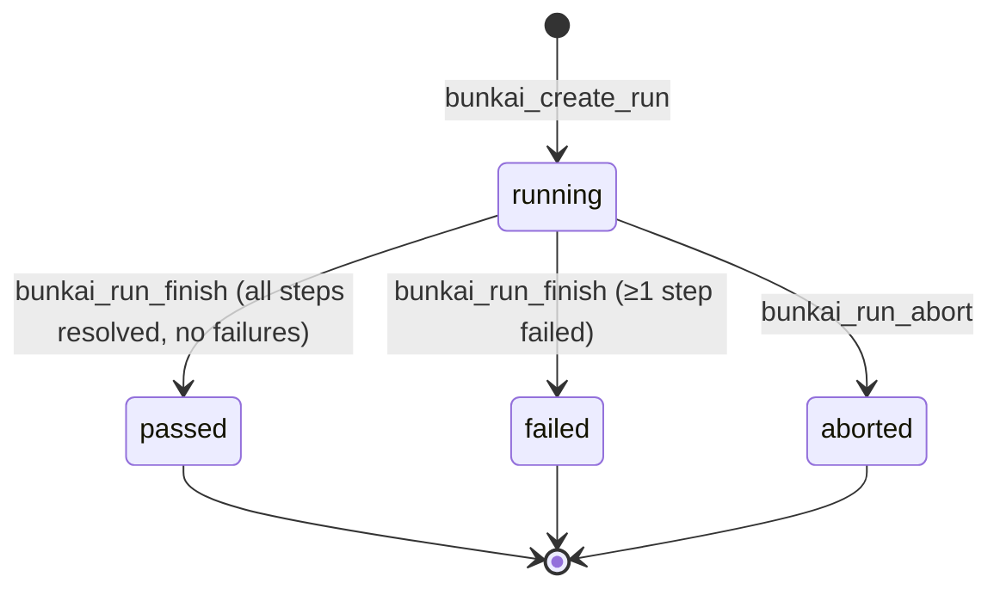
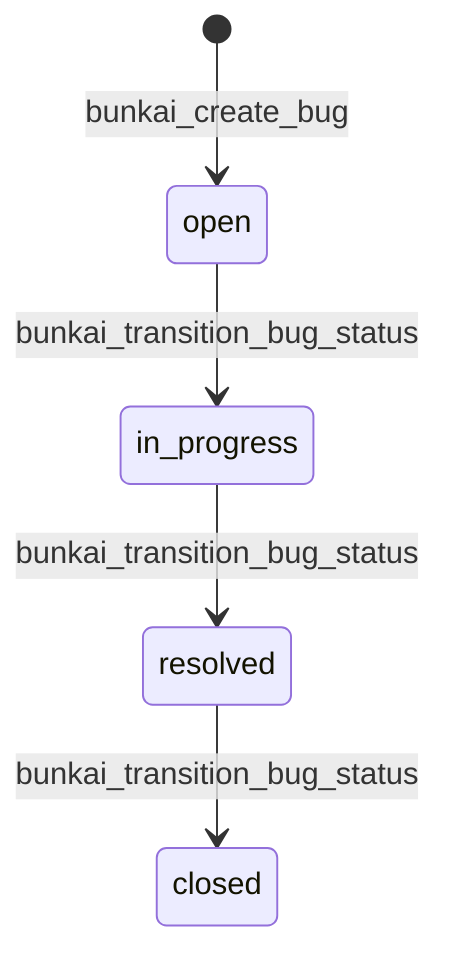

# Functional Specification — Bunkai TMS

> Target repo: `upex-bunkai-tms`. Discovery scope: Phase 2 — SRS, sub-step 2.
> Generated: 2026-08-17.
> **Mindset**: FR entries below are derived directly from `lib/*/validation.ts` Zod schemas, their paired RPC/error-mapping files, and the route handlers that wire them — cross-checked against Phase 1's `domain-glossary.md` (Business Rules BR-1..BR-5) and Phase 2 PRD's `user-journeys.md` for continuity. This is not exhaustive of all 128 API routes; it covers the critical-path flows the PRD already identified as P0/P1 (signup, ATC authoring, Test chaining, Run execution, Bug filing/triage, Milestones) plus the cross-cutting idempotency contract. Routes not detailed here (coverage/metrics/traceability reads, notifications, activity feed) are read-oriented and lower-risk; flagged as scope notes, not silently omitted.

---

## Specification Index

| FR ID | Feature | Category | Priority | Evidence |
|---|---|---|---|---|
| FR-001 | Create an ATC | Authoring | P0 | `lib/atcs/validation.ts`, `0004_atcs.sql`, `0021_atc_create_update.sql` |
| FR-002 | Update (full-replace) an ATC | Authoring | P0 | `lib/atcs/validation.ts`, `0035_atc_update_propagation.sql`, ADR-0009 |
| FR-003 | Duplicate an ATC | Authoring | P2 | `lib/atcs/validation.ts:56-71`, `0028_atc_duplicate.sql` |
| FR-004 | Create a Test (ATC chain) | Authoring | P0 | `lib/tests/validation.ts`, `0024_tests.sql` |
| FR-005 | Reorder a Test's ATC chain | Authoring | P2 | `lib/tests/validation.ts:22-48`, `0026_tests_reorder.sql` |
| FR-006 | Set a Test's tags | Authoring | P3 | `lib/tests/validation.ts:50-82`, `0030_test_tags.sql` |
| FR-007 | Start a manual Run | Execution | P0 | `0031_runs.sql`, ADR-0004 |
| FR-008 | Mark a Run step's result | Execution | P0 | `0042_run_step_mark.sql`, ADR-0004 |
| FR-009 | Abort a Run | Execution | P1 | `0036_run_abort.sql` |
| FR-010 | Finish a Run | Execution | P1 | `0037_run_finish.sql`, `0067_run_finish_abort_via.sql` |
| FR-011 | File a Bug (run-linked) | Defect Mgmt | P0 | `lib/bugs/validation.ts:47-50`, `0046_bugs.sql` |
| FR-012 | File a Bug (standalone) | Defect Mgmt | P1 | `lib/bugs/validation.ts:52-56`, `0046_bugs.sql` |
| FR-013 | Assign / reassign / unassign a Bug | Defect Mgmt | P1 | `lib/bugs/validation.ts:75-79`, `0054_bug_assignment_status.sql` |
| FR-014 | Transition a Bug's status | Defect Mgmt | P0 | `lib/bugs/validation.ts:81-89`, `0054_bug_assignment_status.sql` |
| FR-015 | Create a Milestone | Planning | P2 | `lib/milestones/validation.ts`, `0064_milestones.sql` |
| FR-016 | Edit a Milestone | Planning | P2 | `lib/milestones/validation.ts:74-83`, `0064_milestones.sql` |
| FR-017 | Sign up with email + password | Identity | P0 | ADR-0007, `app/api/v1/auth/signup/route.ts` |
| FR-018 | Confirm account via 6-digit email OTP | Identity | P0 | ADR-0007 |
| FR-019 | Sign in via OAuth (GitHub/Google) | Identity | P1 | ADR-0008 |
| FR-020 | Issue a Personal Access Token | Identity | P1 | ADR-0005, ADR-0006, `0008_access_tokens.sql` |
| FR-021 | Idempotent request replay (cross-cutting) | Platform | P0 | ADR-0002, `lib/api/idempotency.ts` |

Scope note: reporting/read surfaces (`/coverage`, `/metrics/recovery-cycles`, `/bugs/heatmap`, `/traceability`, `/activity`, `/notifications`) and workspace-membership CRUD (`/workspaces/[id]/invites`, `/workspaces/[id]/membership`) are real, evidenced routes (see `architecture.md` §4 directory listing) but were not expanded into individual FR entries in this pass — they are query/aggregation surfaces with comparatively low state-machine/business-rule density versus the authoring/execution/defect flows above. Flag as a follow-up if QA test planning needs them individually specified.

---

## FR-001: Create an ATC

| Field | Value |
|---|---|
| Feature | ATC authoring |
| Related PRD section | `user-journeys.md` Journey 2 |
| Service / method | `POST /api/v1/atcs` → `bunkai_save_atc` / `bunkai_atc_create` RPC |
| Evidence | `lib/atcs/validation.ts:1-54`, `0004_atcs.sql`, `0007_save_atc.sql`, `0021_atc_create_update.sql` |

**Functional Requirement**: A member+ user can create an ATC anchored to exactly one User Story and at least one Acceptance Criterion, with ≥1 ordered step.

**Input Specification**

| Field | Type | Required | Notes |
|---|---|---|---|
| `module_id` | uuid | Yes | Immutable after create |
| `user_story_id` | uuid | Yes | Immutable after create |
| `title` | string, 3–200 chars | Yes | `ATC_TITLE_MIN`/`MAX` |
| `layer` | enum `UI`\|`API`\|`Unit` | Yes | — |
| `tags` | string[], ≤10 | No, default `[]` | `MAX_ATC_TAGS` |
| `steps` | array, ≥1 | Yes | each: `position`, `content` (required, ≤2048 UTF-8 bytes), `input_data`/`expected` (optional, same byte budget) |
| `assertions` | array | No, default `[]` | each: `content` (required, ≤2048 bytes) |
| `acceptance_criterion_ids` | uuid[], ≥1 | Yes | Must belong to `user_story_id` |

**Validation Rules** (evidence: `lib/atcs/validation.ts:9-42`)

```ts
export const MAX_ATC_CONTENT_BYTES = 2048;
export const MAX_ATC_TAGS = 10;
export const ATC_TITLE_MIN = 3;
export const ATC_TITLE_MAX = 200;
// content budget measured via byteLength (UTF-8 bytes), not Zod .max (UTF-16 units)
acceptance_criterion_ids: z.array(z.string().uuid()).min(1)
steps: z.array(AtcStepInputSchema).min(1)
```

Step positions must additionally be integers, strictly increasing, starting at 1 (gaps allowed) — `stepPositionsError()`, `lib/atcs/validation.ts:81-93`.

**Processing Logic**

1. Zod-validate body shape (`AtcCreateBodySchema`) — 422 on failure before any DB round-trip.
2. `stepPositionsError` checks strictly-increasing-from-1 — 422 `steps_position_invalid` on failure.
3. RPC `bunkai_save_atc`/create path validates `module_id`/`user_story_id` belong to the same project (structural — see BR-2, Phase 1 domain-glossary), inserts `atcs` + `atc_steps` + `atc_assertions` + `atc_acceptance_criteria` rows transactionally.
4. Slug derived server-side from title (unique per project — see FR-related error `slug_collision` in the error-code enum, `lib/openapi/registry.ts:44`).

**Output Specification**: 201 with the created ATC payload; 422 on validation failure (`validation_failed`, `steps_position_invalid`); 403 `forbidden` if caller is not `member`+ of the project's workspace.

**Business Rules**

- **BR-2** (Phase 1 domain-glossary): An ATC must anchor to a User Story (`atcs.user_story_id not null references user_stories(id) on delete restrict`) and ≥1 Acceptance Criterion (`atc_acceptance_criteria`, application-layer min-1, independently confirmed at `lib/atcs/validation.ts:41`).

**Edge Cases**

| Case | Expected behavior | Evidence |
|---|---|---|
| Zero steps | 422 `validation_failed` | `steps: z.array(...).min(1)` |
| Zero acceptance criteria | 422 `validation_failed` | `acceptance_criterion_ids: ...min(1)` |
| Step content exceeds 2048 UTF-8 bytes | 422, message `"Content must be at most 2048 bytes."` | `withinContentBudget` |
| Non-sequential step positions (e.g. `[1,3]` starting wrong, or `[2,3]`) | 422 `steps_position_invalid`, offending positions listed | `stepPositionsError` |
| `title` < 3 or > 200 chars | 422 `validation_failed` | `ATC_TITLE_MIN`/`MAX` |

---

## FR-002: Update (full-replace) an ATC

| Field | Value |
|---|---|
| Service / method | `PATCH /api/v1/atcs/{id}` → `bunkai_update_atc` |
| Evidence | `lib/atcs/validation.ts:51-54`, `0035_atc_update_propagation.sql`, ADR-0009 |

**Functional Requirement**: A member+ user can replace an ATC's title/layer/tags/steps/assertions/AC-bindings; anchors (`user_story_id`, `module_id`, `slug`) are immutable.

**Processing Logic** (ADR-0009): PATCH is full-replace, not merge — omitted steps/assertions are cleared. `user_story_id`/`module_id` are accepted-and-ignored if echoed back by a GET→edit→PATCH round-trip, never applied. Propagation to referencing Tests is **reference-based and read-time** — no cascade write, no realtime push; the next read of any Test chaining this ATC reflects the edit automatically because `test_steps.atc_id` is a live FK, never a content copy.

**Output Specification**: `{ atc, version, affected_test_count }` — `affected_test_count` is the **distinct** count of Tests chaining the ATC (a Test referencing it at multiple positions counts once), derived via `bunkai_atc_usage` (`0029`) in the same request, not strictly the same transaction as the edit (ADR-0009 §Consequences — accepted informational imprecision of ±1 in a race window; the emitted `atc.updated` event's `affected_test_ids` remains authoritative).

**Business Rules**

- Anchors (`user_story_id`, `module_id`, `slug`) frozen at create time — `BK-18`/`0021`, reaffirmed and corrected in `scope.md` by ADR-0009. Only `acceptance_criterion_ids` are re-bindable, and only within the fixed User Story.
- No layer-compatibility gate exists — changing `layer` (`UI`\|`API`\|`Unit`) never 422s against referencing Tests, because `tests.layer_policy` does not exist in the schema (ADR-0009 explicitly corrects an unratified architect assumption that it did).

**Edge Cases**

| Case | Expected behavior | Evidence |
|---|---|---|
| Client attempts to change `user_story_id` | Silently ignored (accepted-and-ignored, not rejected) | ADR-0009 Decision §3 |
| `If-Match`/`X-If-Match` header absent | Last-write-wins (header optional) | ADR-0009 Decision §4 |
| `If-Match` present, version mismatch | 409 conflict | ADR-0009 Decision §4 |
| ATC edited via the UI editor path (`bunkai_save_atc`, not `bunkai_update_atc`) | Does NOT emit `atc.updated` event — known gap, tracked as tech-debt | ADR-0009 §Consequences |

---

## FR-004: Create a Test (ATC chain)

| Field | Value |
|---|---|
| Service / method | `POST /api/v1/tests` → `bunkai_create_test` |
| Evidence | `lib/tests/validation.ts:1-20`, `0024_tests.sql:24-31` |

**Functional Requirement**: A member+ user can create a Test as a named, ordered chain of ≥1 ATC reference (duplicates allowed — a chain is a sequence, not a set).

**Input Specification**

| Field | Type | Required | Notes |
|---|---|---|---|
| `title` | string, trimmed, 1–200 chars | Yes | `TEST_TITLE_MAX = 200` |
| `atc_ids` | uuid[], ≥1 | Yes | duplicates legal |
| `workspace_id` | uuid | Conditional | Session callers resolve from cookie; PAT callers must send explicitly |

**Validation Rules**: Zod mirrors the RPC rulebook so malformed bodies fail fast (422) before any DB round-trip; the RPC (`bunkai_create_test`) is the enforcement point of record — SQLSTATE `45120` (chain must contain ≥1 ATC), `45121` (title length), `45122` (cross-workspace/invalid ATC id, non-disclosing).

**Processing Logic**

1. Zod validates shape.
2. `bunkai_create_test` validates in order: role gate (member+) → title bounds → chain has ≥1 ATC → every distinct ATC id resolves inside the target workspace.
3. Foreign-workspace, nonexistent, and NULL ATC ids **collapse into one uniform error** (`45122`, "INV-3 non-disclosure") — deliberately does not reveal which specific id(s) were invalid, to avoid leaking cross-tenant existence information.
4. Adopts the Idempotency-Key contract (FR-021) — first consumer of the pattern.

**Business Rules**

- **BR-3** (Phase 1 domain-glossary): A Test's ATC chain must contain ≥1 ATC, and every ATC must belong to the target workspace.

**Edge Cases**

| Case | Expected behavior | Evidence |
|---|---|---|
| Empty `atc_ids` | 422 (Zod `min(1)`) or RPC `45120` as backstop | `lib/tests/validation.ts:16`, `0024_tests.sql:24-31` |
| ATC id from a different workspace | RPC rejects `45122`, non-disclosing | `0024_tests.sql:24-31` |
| Missing `Idempotency-Key` header | 400 `idempotency_key_required` | `lib/api/idempotency.ts:216-223` |

---

## FR-005: Reorder a Test's ATC chain

| Field | Value |
|---|---|
| Service / method | `PATCH /api/v1/tests/{id}/reorder` |
| Evidence | `lib/tests/validation.ts:22-48`, `0026_tests_reorder.sql` |

**Functional Requirement**: The body is the COMPLETE new order as an array of `step_id`s (`test_steps.id`, not `atc_ids` — a chain may repeat the same ATC at multiple positions, so `step_id` is the only stable handle).

**Processing Logic**: Zod validates shape only (array of uuid strings). Domain rules run in the route: `reorderStructuralError` (non-empty, no duplicate step ids → `chain_invalid` 422) then `chainDiff` (multiset diff between current and submitted step ids — any `missing`/`extra` → `chain_mismatch` 422); set equality is enforced authoritatively under lock inside the RPC as a third layer.

**Edge Cases**

| Case | Expected behavior |
|---|---|
| Empty `step_ids` | `chain_invalid` ("empty") |
| Duplicate `step_id` in submission | `chain_invalid` ("duplicate") |
| Submission omits an existing step or adds a foreign one | `chain_mismatch` |

---

## FR-006: Set a Test's tags

| Field | Value |
|---|---|
| Service / method | `PUT /api/v1/tests/{id}/tags` → `bunkai_set_test_tags` |
| Evidence | `lib/tests/validation.ts:50-82`, `0030_test_tags.sql` |

**Functional Requirement**: Replaces the whole tag set (PUT semantics). Reserved suite tags (`smoke`, `sanity`, `regression`) are lowercased by the RPC.

**Validation Rules**: transform trims + drops blank entries; each tag ≤50 chars, comma-free; ≤20 tags total (`TEST_TAG_MAX_LEN`, `TEST_TAGS_MAX_COUNT`).

**Edge Cases**: a tag containing a comma → 422 `"Tags must not contain commas."`.

---

## FR-007 – FR-010: Run lifecycle (start, mark step, abort, finish)

| Field | Value |
|---|---|
| Evidence | `0031_runs.sql`, `0036_run_abort.sql`, `0037_run_finish.sql`, `0042_run_step_mark.sql`, `0067_run_finish_abort_via.sql`, ADR-0004 |

**Functional Requirement**: A member+ user (or a `human`/`agent`/`ci`-mode caller) starts a Run of a Test against a `project_environments` target; the Run **snapshots** the Test's live ATC chain (`run_atcs`/`run_steps`) at start — once frozen, no later edit/reorder/deletion of the source Test/ATC/step ever alters that Run's record (ADR-0004 invariant).

**Processing Logic**

1. `bunkai_create_run` walks `test_steps → atcs → atc_steps` once, copying content into `run_atcs`/`run_steps`; enforces **domain idempotency** via a transaction-backed 24h lookup on `(test_id, start_token)` under the project write-lock (not a partial unique index — a `now()`-relative predicate cannot be constraint-able).
2. Per step: caller marks pass/fail/blocked/skipped (`run_atcs.status`) — `0042_run_step_mark.sql`.
3. `abort` (`0036`) or `finish` (`0037`) sets `runs.status` to a terminal value (`aborted`/`passed`/`failed`) under `runs.version` (optimistic lock); `0067` records **who** triggered the finish/abort.

**Business Rules**

- Run content provenance is snapshot, never live-reference (ADR-0004 §Decision 1) — this is the explicit resolution of a hard architectural fork; the alternative (live-reference) was rejected because it would silently rewrite historical execution evidence.
- `project_environments` is a first-class FK target, not a hardcoded enum — extensible without a historical-Run data migration (ADR-0004 §Decision 2).

**State Machine — Run status**



| From | To | Trigger | Guard | Side effects |
|---|---|---|---|---|
| (none) | `running` | `bunkai_create_run` | role gate (member+), domain idempotency (`start_token`, 24h) | snapshots chain into `run_atcs`/`run_steps`; `activity_log` `run.started` |
| `running` | `passed`/`failed` | `bunkai_run_finish` | all steps resolved | sets `finished_at`, records actor (`0067`) |
| `running` | `aborted` | `bunkai_run_abort` | — | terminal, run-grain only |

Evidence: `runs.status check in ('running','passed','failed','aborted')` — `0031_runs.sql:79-80`; corroborated by Phase 1 domain-glossary (Run status diagram, cross-checked against dedicated `0036_run_abort.sql`/`0037_run_finish.sql` migrations, marked High confidence there).

**Edge Cases**

| Case | Expected behavior | Evidence |
|---|---|---|
| Test edited/deleted mid-Run | Run's `run_steps` unaffected — this is correct behavior, not a bug ("stale checklist" is by design) | ADR-0004 §Consequences |
| Same `start_token` reused within 24h | Domain idempotency returns/continues the same Run (transaction-backed lookup) | ADR-0004 §Decision 3 |
| Same `start_token` reused after 24h | New Run created (PO-pending decision, working answer = new Run) | ADR-0004 §Neutral/follow-ups |

---

## FR-011 / FR-012: File a Bug (run-linked / standalone)

| Field | Value |
|---|---|
| Service / method | `POST /api/v1/bugs` → `bunkai_create_bug` |
| Evidence | `lib/bugs/validation.ts:1-65`, `0046_bugs.sql:38-87` |

**Functional Requirement**: Two mutually exclusive body shapes — run-linked (`run_step_id`, project/module/run/atc all derived server-side) or standalone (`project_id` + `module_id` explicit). A plain `z.union` (not `discriminatedUnion`, since the two shapes have no shared literal tag) — the route narrows on `'run_step_id' in body`.

**Input Specification**

| Field | Type | Required | Applies to |
|---|---|---|---|
| `title` | string, trimmed, 5–200 chars | Yes | both |
| `severity` | enum `P1`\|`P2`\|`P3`\|`P4` | Yes | both |
| `description` | string | No | both |
| `steps_to_reproduce` | string | No | both |
| `evidence_urls` | url[], ≤ `BUG_EVIDENCE_MAX` | No | both |
| `run_step_id` | uuid | Yes (run-linked) | run-linked only |
| `project_id`, `module_id` | uuid | Yes (standalone) | standalone only |

**Validation Rules**: `BUG_TITLE_MIN`/`MAX` (5–200), `evidence_urls` capped at `BUG_EVIDENCE_MAX` and each must be a valid URL; run-linked bodies never carry `project_id`/`module_id`/`run_id`/`atc_id` on the wire — even if a caller sends them, Zod's default "strip unknown keys" silently drops them once the run-linked branch matches, so they can never reach the RPC from that path.

**Processing Logic**: `bunkai_create_bug` re-validates module ∈ project independently of the TS layer, and additionally — per **BR-4** — validates that `run_id`/`run_step_id`/`atc_id` (when present) all belong to the same Project as the Bug, closing a cross-tenant provenance-injection gap found during adversarial review.

**Business Rules**

- **BR-4** (Phase 1 domain-glossary): A Bug's provenance links must all belong to the same Project as the Bug. SQLSTATE `45300`–`45307` (module-outside-project, title/severity/evidence backstops, project-outside-workspace, run/run-step/ATC-outside-project).

**Edge Cases**

| Case | Expected behavior | Evidence |
|---|---|---|
| Title outside 5–200 chars | 422, `` `Title must be between 5 and 200 characters` `` | `lib/bugs/validation.ts:24` |
| `run_id` belongs to a different Project than the Bug's own | RPC rejects `45305` | BR-4 |
| `evidence_urls` not a valid URL | 422 Zod `.url()` failure | `evidenceUrlsSchema` |

---

## FR-013: Assign / reassign / unassign a Bug

| Field | Value |
|---|---|
| Service / method | `POST /api/v1/bugs/{id}/assign` |
| Evidence | `lib/bugs/validation.ts:75-79`, `0054_bug_assignment_status.sql` |

**Functional Requirement**: `assignee_user_id: null` unassigns; a non-null value assigns/reassigns, gated by workspace-membership eligibility.

**Business Rules**

- Assignee must have an **active** `workspace_members` row in the Bug's own workspace — else `45312 bug_assignee_not_workspace_member`.
- Assignee's role must not be `viewer` — else `45313 bug_assignee_view_only`.
- Authorization model (ADR-0012's own worked example of "delete the identity parameter"): the RPC takes **no explicit actor parameter**, reading `auth.uid()` directly — the DEFINER escalation exists only to read the *assignee's* `workspace_members` row (invisible to a non-admin caller under normal RLS), not to accept a caller-asserted identity.

**Edge Cases**

| Case | Expected behavior | Evidence |
|---|---|---|
| Assignee not an active member of the Bug's workspace | `45312` | migration `0054` header comment |
| Assignee has `viewer` role | `45313` | migration `0054` header comment |
| Bug not found, or caller not a workspace member | Uniform `bug_not_found` (P0002) — non-disclosing | migration `0054` header comment |

---

## FR-014: Transition a Bug's status

| Field | Value |
|---|---|
| Service / method | `POST /api/v1/bugs/{id}/status` → `bunkai_transition_bug_status` |
| Evidence | `lib/bugs/validation.ts:81-89`, `0054_bug_assignment_status.sql` |

**Functional Requirement**: A Bug's status advances **one stage forward at a time, never backward** — `open → in_progress → resolved → closed`.

**Processing Logic**: enforced procedurally in two layers since a plain CHECK constraint cannot see the previous row: (1) primary, friendly-message enforcement inside `bunkai_transition_bug_status` (holds OLD status in the same call); (2) backstop — the existing `bunkai_bugs_check_consistency` `BEFORE INSERT OR UPDATE` trigger, extended to carry the same adjacency + assignee-eligibility checks, as defense-in-depth against a direct-table write bypassing the RPC.

**State Machine — Bug status**



| From | To | Trigger | Guard | SQLSTATE on violation |
|---|---|---|---|---|
| `open` | `in_progress` | transition RPC | one stage forward only | — |
| `in_progress` | `resolved` | transition RPC | one stage forward only | — |
| `resolved` | `closed` | transition RPC | one stage forward only | — |
| any | (skip a stage, e.g. `open`→`resolved`) | transition RPC | rejected | `45310 bug_status_transition_skipped` |
| any | (same or earlier stage) | transition RPC | rejected | `45311 bug_status_transition_backward` |

**Note — supersedes Phase 1's provisional diagram**: Phase 1's `domain-glossary.md` recorded the Bug status transition table as an unverified "unrestricted lattice" over the 4 values (explicit Discovery Gap at the time, since `lib/bugs/transition-bug-status-isolation.test.ts` existed but was not read). This FR entry resolves that gap: the transition set is **strictly forward, one stage at a time**, not an open lattice — confirmed from `0054_bug_assignment_status.sql`'s own migration header (SQLSTATE `45310`/`45311`).

---

## FR-015 / FR-016: Create / edit a Milestone

| Field | Value |
|---|---|
| Service / method | `POST /api/v1/projects/{id}/milestones`, `PATCH /api/v1/milestones/{id}` → `bunkai_create_milestone` / `bunkai_update_milestone` |
| Evidence | `lib/milestones/validation.ts`, `lib/milestones/errors.ts`, `0064_milestones.sql` |

**Input Specification**

| Field | Type | Required | Notes |
|---|---|---|---|
| `name` | string, 1–100 chars | Yes | normalized: whitespace-collapsed then trimmed; unique per project, case-insensitive |
| `description` | string, ≤500 chars | No, default `''` | — |
| `target_date` | date-only string (`YYYY-MM-DD`) | Yes | bounds: today ≤ date ≤ today+5y |

**Business Rules**

- **BR-5** (Phase 1 domain-glossary): target-date bounds are **write-time only**, not a standing row invariant — the RPC guard fires only when `p_target_date is distinct from` the currently stored value. A Milestone whose date has since passed remains editable for non-date fields (e.g. `description`) without re-triggering the past-date rejection. This is a deliberate design choice, not an oversight: a standing CHECK would make an originally-valid milestone permanently un-editable once its date passed.
- Deployed create route always calls the bound check unconditionally; the edit route calls it only when the date actually changes — mirroring the RPC's own conditional guard (`lib/milestones/validation.ts:74-83` comment).

**Edge Cases**

| Case | Expected behavior | SQLSTATE |
|---|---|---|
| Name > 100 chars | 422 | `45500` |
| Description > 500 chars | 422 | `45501` |
| `target_date` in the past (on create, or on edit WHEN the date changes) | 422 | `45502` |
| `target_date` more than 5 years out | 422 | `45503` |
| Duplicate name (case/whitespace-insensitive) in the same project | 409 conflict | `23505` (native unique violation) |
| Editing only `description` on a Milestone whose date is already in the past | Succeeds — date rule does not re-fire | BR-5 |

---

## FR-017 / FR-018: Sign up + confirm via email OTP

| Field | Value |
|---|---|
| Evidence | ADR-0007, `app/api/v1/auth/{signup,confirm,check-email}/route.ts` |

**Functional Requirement**: `POST /api/v1/auth/signup` calls `supabase.auth.signUp` and returns `202 { status: 'pending_confirmation', email }` — **no session, no PAT** minted at signup. `POST /api/v1/auth/confirm` accepts `{ email, token (6 digits) }`, verifies via `supabase.auth.verifyOtp`, and on success returns the identical shape as `signin` (`{ user, session, pat, warning }`, 200).

**Business Rules**

- No public auto-confirm path exists — the prior `createUser({ email_confirm: true })` admin backdoor is deleted from the public surface (ADR-0007 §Decision 2).
- PAT minted on confirm/signin defaults to `DEFAULT_PAT_SCOPES = ['atc:read','atc:write','run:execute']` — `workspace:admin` can never be minted through a headless auth flow (ADR-0005/ADR-0007 interaction).
- `POST /api/v1/auth/check-email` deliberately accepts a user-enumeration tradeoff (`{ exists, confirmed }`) to satisfy the AC requirement that routing (password step vs. create step) happens before a password is collected; mitigated only by Supabase's built-in throttling at MVP (no dedicated app-level rate limiter — ADR-0007 §Follow-ups).

**Edge Cases**

| Case | Expected behavior |
|---|---|
| Sign-in attempt on an existing-but-unconfirmed account | Routes to OTP verify step (via `check-email`'s `confirmed` flag), not a generic "wrong password" |
| OTP token incorrect/expired | `verifyOtp` failure — exact error shape not independently re-traced in this pass (**Discovery Gap**) |

---

## FR-019: Sign in via OAuth (GitHub / Google)

| Field | Value |
|---|---|
| Evidence | ADR-0008 |

**Functional Requirement**: OAuth starts server-side at `GET /auth/oauth/[provider]` (not a browser-side SDK call), so a CSRF `state` cookie can be minted before the browser leaves for the provider.

**Business Rules**

- Independent, server-issued CSRF `state` token layered on top of Supabase's own PKCE — required because PKCE alone surfaces failures as a generic redirect/exchange error, not the literal `403 OAUTH_STATE_MISMATCH` the spec demands.
- Automatic identity linking is enabled (PO decision) — identities sharing a verified email (GitHub/Google/password) link to one account; there is no `EMAIL_EXISTS` error path.
- No PAT is minted at OAuth login — a 302 redirect cannot return a JSON PAT; OAuth users mint one later via the tokens UI.

**Edge Cases**

| Case | Expected behavior |
|---|---|
| `bkstate` cookie missing or mismatched | `403 { code: 'OAUTH_STATE_MISMATCH' }`, no session, one-time-use cookie deleted |
| Provider `error` param (consent denied) | `302 /login?error=oauth_denied` |
| `exchangeCodeForSession` fails | `oauth_init_failed` |

---

## FR-020: Issue a Personal Access Token

| Field | Value |
|---|---|
| Evidence | ADR-0005, ADR-0006, `0008_access_tokens.sql` |

**Functional Requirement**: `POST /api/v1/tokens` (cookie-session only — a PAT cannot mint a PAT). Caller supplies `scopes[]` and optional `workspace_id`.

**Business Rules**

- A PAT may carry `workspace:admin` **only if** bound to a specific `workspace_id` AND the issuer holds `admin`/`owner` role in that workspace — else 403 (ADR-0005 invariant).
- Global (`workspace_id = null`) tokens remain allowed for non-admin scopes (`atc:read`/`atc:write`/`run:execute`) only.
- Consumption-side: an admin operation requires (a) the capability, (b) for PATs, `assertWorkspaceContext` binding the token's `workspace_id` to the operation's target workspace, (c) `admin`/`owner` role via RLS — all three, none redundant (ADR-0006).

**Edge Cases**

| Case | Expected behavior |
|---|---|
| Non-admin/owner requests `workspace:admin` scope | 403 `forbidden` |
| `workspace:admin` requested with no `workspace_id` | 403 `forbidden` |
| A workspace-A-scoped admin PAT calls an admin op targeting workspace B | 403 (`assertWorkspaceContext` mismatch) |

---

## FR-021: Idempotent request replay (cross-cutting)

| Field | Value |
|---|---|
| Evidence | ADR-0002, `lib/api/idempotency.ts:1-258`, `0009_cross_cutting.sql` |

**Functional Requirement**: Any mutating endpoint that adopts idempotency (first consumer: `POST /api/v1/tests`, FR-004) requires an `Idempotency-Key` header. Scope = `(user_id, endpoint, key)` — two different users, or the same user on two different endpoints, never collide.

**Processing Logic**

1. Compute SHA-256 of the stable-stringified payload; look up `(user_id, endpoint, key)`.
2. Row found + same hash + `succeeded` → replay: return the stored response snapshot verbatim (no second write).
3. Row found + different hash → 409 `conflict` (key reused for a different payload).
4. Row found + same hash + `pending` → 409 `conflict` (in flight, retry shortly).
5. Row found + same hash + `failed` → atomic compare-and-set reclaims the row (`failed`→`pending`); a losing concurrent claim → 409.
6. No row → insert `pending`; a losing concurrent insert (unique-constraint 23505) → 409.
7. Window = the row's 24h TTL.

**Edge Cases**

| Case | Expected behavior | Evidence |
|---|---|---|
| Missing `Idempotency-Key` header | 400 `idempotency_key_required` | `lib/api/idempotency.ts:216-223` |
| Header not matching `^[\w-]{8,128}$` | 400 `idempotency_key_invalid` | `lib/api/idempotency.ts:225-231` |
| Replay after the 24h TTL expires | New entity created (accepted — matches payment-industry norms) | ADR-0002 §Consequences |
| `workspace_id` in payload references a nonexistent workspace | 422 `validation_failed` (FK 23503 mapped, not opaque 500) | `lib/api/idempotency.ts:151-172` |

---

## State Machines Summary

Two confirmed, code-verified state machines exist in this schema (both are State-Transition/BVA technique triggers per this repo's test-design doctrine):

1. **Run status** (`running → passed/failed/aborted`, all terminal) — see FR-007–010.
2. **Bug status** (`open → in_progress → resolved → closed`, strictly forward, one stage at a time) — see FR-014. This resolves a Phase 1 Discovery Gap (the transition rule set was previously unverified).

No other enum column in the schema (`atcs.status`, `atcs.layer`, `workspace_members.role/status`) has an independently-verified transition-guard function — those are classification/label fields, not workflow state machines, per this pass's reading.

---

## Business Rules Summary (cross-FR)

| BR | Summary | FRs affected |
|---|---|---|
| BR-2 | ATC must anchor to a User Story + ≥1 AC | FR-001, FR-002 |
| BR-3 | Test chain ≥1 ATC, all same-workspace | FR-004 |
| BR-4 | Bug provenance links must share the Bug's own Project | FR-011, FR-012 |
| BR-5 | Milestone date bound is write-time-only, not standing | FR-015, FR-016 |
| (new) Bug status forward-only | One stage at a time, never backward | FR-014 |
| (new) ATC anchors immutable on edit | `user_story_id`/`module_id`/`slug` frozen | FR-002 |
| (new) Idempotency scope | `(user_id, endpoint, key)`, 24h TTL, header mandatory | FR-004, FR-021 |
| (new) PAT admin-scope gate | `workspace:admin` requires explicit `workspace_id` + admin/owner issuer | FR-020 |

## Validation Rules Catalog

| Entity | Field | Rule | Error message | Evidence |
|---|---|---|---|---|
| ATC | `title` | 3–200 chars | (Zod default) | `lib/atcs/validation.ts:16-17` |
| ATC | step/assertion `content` | ≥1 char, ≤2048 UTF-8 bytes | `"Content must be at most 2048 bytes."` | `lib/atcs/validation.ts:19-20` |
| ATC | `acceptance_criterion_ids` | ≥1 | (Zod default) | `lib/atcs/validation.ts:41` |
| ATC | `tags` | ≤10 | (Zod default) | `lib/atcs/validation.ts:15,38` |
| Test | `title` | trimmed, 1–200 chars | (Zod default) | `lib/tests/validation.ts:8,14` |
| Test | `atc_ids` | ≥1 | (Zod default) | `lib/tests/validation.ts:16` |
| Test | tag | ≤50 chars, no commas, ≤20 tags | `"Tags must not contain commas."` | `lib/tests/validation.ts:59-81` |
| Bug | `title` | trimmed, 5–200 chars | `"Title must be between 5 and 200 characters"` | `lib/bugs/validation.ts:24,26-30` |
| Bug | `evidence_urls` | valid URL, ≤ `BUG_EVIDENCE_MAX` | (Zod default) | `lib/bugs/validation.ts:34-37` |
| Milestone | `name` | 1–100 chars, whitespace-collapsed+trimmed, unique/project (case-insensitive) | `"Name must be 100 characters or fewer"` | `lib/milestones/validation.ts:43-51` |
| Milestone | `description` | ≤500 chars | `"Description must be 500 characters or fewer"` | `lib/milestones/validation.ts:53-57` |
| Milestone | `target_date` | today ≤ date ≤ today+5y (write-time-only bound) | `"Target date must be today or later."` / `"...within the next 5 years."` | `lib/milestones/validation.ts:92-105` |
| Idempotency-Key | header | `^[\w-]{8,128}$` | `"idempotency-key must be 8–128 chars, [a-zA-Z0-9_-]."` | `lib/api/idempotency.ts:225-231` |

---

## Discovery Gaps

- [ ] Notifications (`0053`), notification preferences (`0062`), and import-job (`0019`) domains have real routes and validation files (per `architecture.md` directory listing) but were not expanded into FR entries in this pass — lower state-machine density, deferred.
- [ ] Exact OTP failure-response shape (`confirm` route, wrong/expired 6-digit code) — not independently re-traced.
- [ ] Whether `member`/`admin`/`owner` role transitions (workspace membership re-role) carry any guard beyond the RLS role check — not traced as an FR in this pass.
- [ ] `atcs.status` (`pass`\|`fail`\|`blocked`\|`skipped`\|`running`\|`unrun`) — a classification field on the ATC row, distinct from `run_atcs.status` — its write path/trigger was not traced independently; unclear whether it is derived automatically from Run history or independently settable.
- [ ] Reporting/aggregation endpoints (coverage, defect heatmap, recovery-cycle metrics, traceability chain) — real, evidenced (`0048`–`0052`, `0068`), but not functionally specified here; primarily read/aggregation logic, lower business-rule density than the authoring/execution/defect flows.

## QA Relevance

- Every FR above pairs a client-side Zod check with a server-side RPC/trigger backstop — a valid test-design target is deliberately bypassing the client (direct API call) to confirm the backstop actually enforces the same rule, not just the UI.
- Boundary-value technique triggers: ATC/Test/Milestone title length bounds, step content byte budget, tag count/length caps, Milestone date bounds (today / today+5y), Bug title bounds, evidence URL count cap.
- State-Transition technique triggers: Bug status (forward-only, one stage), Run status (three terminal states from one running state).
- Decision-Table technique trigger: Bug provenance validation (BR-4) has 2+ interacting conditions (module∈project, run∈project, run_step∈project, atc∈project) — a pairwise/decision-table design is warranted, not a single happy-path case.
- Non-disclosure error patterns (Test cross-workspace ATC = `45122`; Milestone not-found = uniform `P0002`; Bug not-found = uniform `bug_not_found`) are themselves testable security properties — assert the error response does NOT distinguish "doesn't exist" from "exists but you can't see it."

## Sources Used

- `upex-bunkai-tms/lib/{atcs,tests,bugs,milestones}/validation.ts`, `lib/milestones/errors.ts`
- `upex-bunkai-tms/lib/api/{idempotency,handler}.ts`
- `upex-bunkai-tms/supabase/migrations/{0004,0007,0008,0009,0021,0024,0026,0028,0029,0030,0031,0035,0036,0037,0042,0046,0054,0064,0067}*.sql`
- `upex-bunkai-tms/.context/ADR/ADR-0002, 0004, 0005, 0006, 0007, 0008, 0009, 0012`
- Phase 1 (this repo): `.context/business/domain-glossary.md` (BR-1..BR-5, prior state-machine diagrams)
- Phase 2 PRD (this repo): `.context/PRD/user-journeys.md` (P0/P1 scenario priorities used to scope this document)
