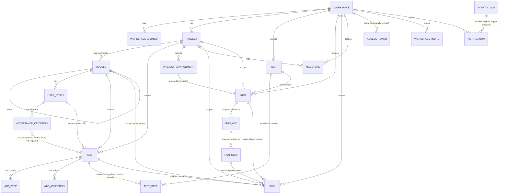

# Business Data Map — Bunkai (discovered)

> Target repo: `upex-bunkai-tms` (read-only — nothing in that repo was modified to produce this document).
> Primary source of truth: `upex-bunkai-tms/supabase/migrations/0001_*.sql` through `0068_story_traceability_report.sql` (68 files — no ORM in this project; migrations ARE the schema, per `.context/project-config.md`). All 68 migrations were inventoried; 38 were read in full (every migration that creates a table, adds/drops a column, or changes a constraint). The remainder are read-only report RPCs, index-only migrations, or trigger amendments that touch no schema shape not already covered by an earlier read — see Discovery Gaps §5 for the exact list and why each was safe to skip.
> Cross-checked against: `.context/business/domain-glossary.md` and `.context/business/business-model.md` (both already present in this repo, generated by `/project-discovery`), `upex-bunkai-tms/.context/ADR/ADR-0004-run-snapshot-and-environments.md`, and the Jira defect record `DEFECT-BK-317` (synced locally at `qa-engineering-bunkai/.context/PBI/epics/EPIC-BK-44-coverage-traceability/stories/STORY-BK-45-.../defects/DEFECT-BK-317-...md`).
> Generated: 2026-08-17.

Terminology in this document follows `domain-glossary.md` exactly: **Workspace**, **Project**, **Module**, **User Story**, **Acceptance Criterion (AC)**, **ATC (Acceptance Test Case)**, **Test**, **Run**, **Bug** (a.k.a. Defect in Jira-facing prose — same entity), **Milestone**, **Project Environment**, **Personal Access Token (PAT)**. No synonyms are invented.

---

## 1. Entity-relationship overview

Bunkai's schema is a single deep chain from tenant root to evidence leaf, plus four supporting clusters (auth/tokens, async jobs, cross-cutting audit/notification, and personal preferences). Every table in the primary chain resolves back to exactly one `workspace_id`, directly or by walking parent FKs — this is what makes Row-Level Security (RLS) tractable (see §4).

```
Workspace (tenant root)
  |-- WorkspaceMember (RBAC: viewer/member/admin/owner)
  |-- WorkspaceInvite --owns--> WorkspaceInviteSecret
  |-- AccessToken (PAT) --owns--> AccessTokenSecret
  |-- Test  (workspace-scoped, NOT project-scoped)
  |     `-- TestStep (ordered chain of ATC references, duplicates allowed)
  |-- Run   (workspace + project scoped)
  |-- Bug   (workspace + project scoped)
  |-- Milestone (workspace + project scoped)
  |-- Notification (per-recipient inbox row)
  |-- Project
        |-- Module (self-referential tree, depth <= 6, materialized `path`)
        |     |-- UserStory
        |     |     `-- AcceptanceCriterion (ordered, 1:N)
        |     |-- ATC (anchored to exactly 1 UserStory, >=1 AcceptanceCriterion)
        |     |     |-- ATCStep (ordered)
        |     |     |-- ATCAssertion (ordered)
        |     |     `-- (M:N) AcceptanceCriterion  [atc_acceptance_criteria]
        |     `-- Bug (module_id always populated, even for run-linked bugs)
        |-- ProjectEnvironment (e.g. Staging, Production)
        `-- Milestone

Test --[test_steps.atc_id, references not copies]--> ATC

Run --targets--> ProjectEnvironment
Run --executes--> Test (snapshot taken at start)
  `-- RunATC (1 per chain position, SNAPSHOT of atc_title)
        `-- RunStep (1 per executable step, SNAPSHOT of content/input/expected)

Bug --optional provenance--> Run, RunStep, ATC (all ON DELETE SET NULL)

ActivityLog   <-- audit row written by every mutating RPC (DEFINER-only writer)
Notification  <-- produced from ActivityLog by AFTER INSERT triggers (run/bug events)
NotificationPreference --belongs to--> a single user (global, cross-workspace)
ImportJob --belongs to--> Workspace + Project (async Jira import)
```



---

## 2. Per-entity detail

### 2.1 Workspace — `public.workspaces`

Multi-tenant root; every other table resolves back to a `workspace_id`.

| Column | Type / constraint |
|---|---|
| `id` | uuid PK |
| `slug` | text, unique |
| `name` | text |
| `owner_user_id` | uuid, FK -> `auth.users`, `on delete restrict` |
| `plan` | text, default `'community'`, CHECK in (`community`,`cloud`,`enterprise`) |
| `created_at` | timestamptz |

RLS: SELECT for any active member (`bunkai_is_workspace_member`); UPDATE/DELETE owner-role only (`bunkai_is_workspace_owner`); INSERT self-check `auth.uid() = owner_user_id`. Created atomically with the caller's own `owner` `workspace_members` row via `bunkai_bootstrap_workspace` (0006) to avoid the chicken-and-egg where the INSERT policy on `workspace_members` itself requires an existing admin/owner.

Notable rule: `plan` is modeled (community/cloud/enterprise) but **no billing logic gates behavior on it** anywhere in the 68 migrations read — confirmed in `business-model.md` §5, restated here because it is schema-observable, not just doc-observed.

Migrations: `0001_tenancy.sql`, `0005_rls_helpers.sql`, `0006_bootstrap_workspace.sql`.

### 2.2 WorkspaceMember — `public.workspace_members`

RBAC join table. Composite PK `(workspace_id, user_id)` — no surrogate id.

| Column | Type / constraint |
|---|---|
| `workspace_id` | uuid FK -> workspaces, `on delete cascade` |
| `user_id` | uuid FK -> `auth.users`, `on delete cascade` |
| `role` | text, default `'member'`, CHECK in (`viewer`,`member`,`admin`,`owner`) |
| `status` | text, default `'active'`, CHECK in (`active`,`invited`,`suspended`) |
| `joined_at` | timestamptz |

RLS: SELECT self row OR admin/owner of the workspace; INSERT/UPDATE/DELETE admin/owner only. All downstream RLS on every other table ultimately bottoms out in a `workspace_members` lookup — 0005 replaced naive inline `EXISTS` subqueries with four `SECURITY DEFINER STABLE` helper functions (`bunkai_is_workspace_member`, `bunkai_can_write_workspace`, `bunkai_is_workspace_admin`, `bunkai_is_workspace_owner`) specifically to fix a `42P17` infinite-recursion error the naive version produced — this is the single load-bearing RLS pattern reused by every table below marked "workspace member" / "member+ write".

Self-service exit: `bunkai_leave_workspace` (0044) lets a member delete their own row, blocked when it is their last active membership anywhere (`45212 last_membership`) or when they are the workspace's sole active owner (`45213 sole_owner`, count-based — any owner may leave as long as >=1 other active owner remains). On success it also soft-revokes (`revoked_at = now()`) the caller's workspace-scoped `access_tokens`.

Migrations: `0001_tenancy.sql`, `0005_rls_helpers.sql`, `0044_leave_workspace.sql`.

### 2.3 WorkspaceInvite / WorkspaceInviteSecret — `public.workspace_invites` / `public.workspace_invite_secrets`

| `workspace_invites` column | Type / constraint |
|---|---|
| `id` | uuid PK |
| `workspace_id` | uuid FK, cascade |
| `email` | text |
| `role` | text, default `'member'`, CHECK in (`viewer`,`member`,`admin`) — **never `owner`**, unlike `workspace_members.role` |
| `invited_by_user_id` | uuid FK -> auth.users, `set null` |
| `expires_at` | timestamptz, default now()+7 days |
| `accepted_at` / `accepted_by_user_id` / `revoked_at` | nullable |

`workspace_invite_secrets(invite_id PK/FK, token_hash unique)` holds the SHA-256 of the raw invite token; split out in 0011 specifically so a `qa_inspector_ro`/`qa_inspector_rw` analytics role — which the migration comment says is auto-granted SELECT on every new public table via an `ALTER DEFAULT PRIVILEGES` rule — cannot read the secret column (Postgres cannot hide one column once a table-level grant exists, so the whole secret was moved to a sibling table and REVOKEd). The same split pattern applies to `access_token_secrets` (2.9) and `magic_link_token_secrets` (2.10). RLS: `workspace_invites` SELECT/INSERT/UPDATE/DELETE all admin/owner only; the secret sibling tables carry **no** client policy at all — `service_role` only.

Migrations: `0010_workspace_invites.sql`, `0011_split_token_secrets.sql`, `0012_drop_legacy_token_hashes.sql`, `0022_invite_integrity_user_lookup.sql`.

### 2.4 Project — `public.projects`

| Column | Type / constraint |
|---|---|
| `id` | uuid PK |
| `workspace_id` | uuid FK, cascade |
| `slug` | text, unique per `(workspace_id, slug)` |
| `name` | text |
| `description` | text, nullable |
| `created_at` | timestamptz |

RLS: SELECT any active member; INSERT/UPDATE/DELETE member+ write role.

Migrations: `0002_projects_modules.sql`, `0005_rls_helpers.sql`.

### 2.5 Module — `public.modules`

Self-referential tree partitioning a Project's authoring surface.

| Column | Type / constraint |
|---|---|
| `id` | uuid PK |
| `project_id` | uuid FK, cascade |
| `parent_module_id` | uuid FK -> modules, cascade, nullable (root = null) |
| `path` | text, materialized slash-separated ancestor chain, unique per `project_id` |
| `name` | text |
| `position` | int |
| `description` | text, nullable, CHECK <= 500 chars (0013) |
| `archived_at` | timestamptz, nullable (soft delete, 0014) |

Structural rule: `constraint modules_path_depth_max_6 check (array_length(string_to_array(path, '/'), 1) between 1 and 6)` — `0002_projects_modules.sql`.

Three `SECURITY DEFINER` RPCs own every structural mutation (all role-gated via `bunkai_can_write_workspace`, all emit an `activity_log` audit row atomically per `0023`):
- `bunkai_update_module` — rename (+ optional description); rebuilds the module's own `path` **and every descendant's** in one `UPDATE`; a sibling-slug collision raises `23505`.
- `bunkai_move_module` — re-parent + re-base the subtree's paths atomically. Guards: no-op on same-parent, cycle detection via path-prefix test (`45001 move_cycle`), depth-6 re-check on the deepest resulting node (`45002 depth_exceeded`), parent-not-found (`45003 parent_invalid`).
- `bunkai_archive_module_subtree` — cascade soft-delete: the module, every active descendant module, and their linked `user_stories`/`acceptance_criteria`/`atcs`, all in one transaction. **Known gap** (AI Tech Lead D11, cited verbatim by `0068`): the recursive walk can strand a live descendant module under an already-archived intermediate ancestor in some edge cases — `0068`'s traceability report defends against this explicitly with an `archived_anc` path-prefix closer; zero orphans were measured live at that migration's authoring time.

Migrations: `0002_projects_modules.sql`, `0013_module_description.sql`, `0014_module_soft_delete.sql`, `0015_module_move.sql`, `0023_module_activity_log.sql`.

### 2.6 User Story — `public.user_stories`

| Column | Type / constraint |
|---|---|
| `id` | uuid PK |
| `module_id` | uuid FK -> modules, cascade |
| `project_id` | uuid FK -> projects, cascade (denormalized in 0016 for a local uniqueness scope) |
| `title` | text |
| `description` | text, nullable |
| `external_id` / `external_url` | text, nullable — Jira-import provenance |
| `status` | text, default `'draft'`, CHECK in (`draft`,`ready_to_test`) — added 0017 |
| `archived_at` | timestamptz, nullable |

Rule: `user_stories_project_external_id_uniq` — partial unique index on `(project_id, upper(external_id))` over active rows with non-null `external_id` — case-insensitive, so re-importing the same Jira key from a re-run import job cannot create a duplicate.

`ready_to_test` gate (`bunkai_set_user_story_status`, 0018): setting a story to `ready_to_test` requires >=1 active Acceptance Criterion, else `45010 ac_required_for_ready_to_test`; the setter and `bunkai_archive_acceptance_criterion` both take the same `FOR UPDATE` row lock on the story, closing a TOCTOU race where a concurrent last-criterion archive could otherwise strand a story `ready_to_test` with zero active criteria. Archiving the last active AC auto-reverts the story to `draft`.

Migrations: `0003_authoring.sql`, `0014_module_soft_delete.sql`, `0016_user_story_uniqueness.sql`, `0017_acceptance_criteria_ordering.sql`, `0018_ready_to_test_gate_fn.sql`.

### 2.7 AcceptanceCriterion — `public.acceptance_criteria`

| Column | Type / constraint |
|---|---|
| `id` | uuid PK |
| `user_story_id` | uuid FK, cascade |
| `title` | text |
| `description` | text, nullable |
| `position` | int, unique per **active** `user_story_id` (partial unique index, 0017 — archived rows release their slot) |
| `archived_at` | timestamptz, nullable |

Three `SECURITY DEFINER` RPCs (0017) rebalance `position` collision-free via a "negative-parking" trick (park the affected active siblings at negative positions, then re-assign the final positive values) so the partial unique index never observes a transient duplicate mid-shift: `bunkai_insert_acceptance_criterion`, `bunkai_move_acceptance_criterion`, `bunkai_archive_acceptance_criterion`.

Migrations: `0003_authoring.sql`, `0014_module_soft_delete.sql`, `0017_acceptance_criteria_ordering.sql`, `0018_ready_to_test_gate_fn.sql`.

### 2.8 ATC (Acceptance Test Case) — `public.atcs` + `atc_steps` + `atc_assertions` + `atc_acceptance_criteria`

The product's structural differentiator (see `business-model.md` §1/§4: "traceability by construction").

| `atcs` column | Type / constraint |
|---|---|
| `id` | uuid PK |
| `project_id` | uuid FK, cascade |
| `module_id` | uuid FK, cascade |
| `user_story_id` | uuid FK -> user_stories, **`on delete restrict`** |
| `slug` | text, unique per `project_id`; immutable, minted as `<module-slug>/atc-<8 hex>` by every create/duplicate RPC, never client-supplied |
| `title` | text, CHECK length >= some minimum (tightened 0058, exact bound in that migration) |
| `layer` | text, CHECK in (`UI`,`API`,`Unit`) |
| `version` | int, default 1, bumped on every save (optimistic-lock handle) |
| `status` | text, default `'unrun'`, CHECK in (`pass`,`fail`,`blocked`,`skipped`,`running`,`unrun`) — **the ATC's own last-known-result status, independent of any one Run** |
| `tags` | text[], default `{}`, capped (0065 `atc_tags_cap_guard`) |
| `tsv` | tsvector, refreshed by a `BEFORE INSERT OR UPDATE OF title, tags` trigger (not a GENERATED column — `to_tsvector` is not IMMUTABLE enough) |
| `archived_at` | timestamptz, nullable |

`atc_steps(id, atc_id FK cascade, position unique per atc_id, content, input_data, expected)` and `atc_assertions(id, atc_id FK cascade, position unique per atc_id, content)` — both ordered children.

`atc_acceptance_criteria(atc_id, acceptance_criterion_id)` — M:N join, composite PK, both legs `on delete cascade`. **This join table carries no `project_id`/`workspace_id` column of its own** — a fact `0068` flags explicitly as the single load-bearing scope gap in the whole schema: any RPC that reads across this join must re-scope through an already-project-filtered ATC set, or a cross-project ATC can enter a chain it should never reach (this exact class of leak "shipped once already" per `0068`'s own comment, referencing migration `0047`'s incident).

Business rule structurally enforced: an ATC's `user_story_id` FK is `not null ... on delete restrict` (a User Story with live ATCs cannot be deleted); the >=1-Acceptance-Criterion minimum is enforced at the **application layer** inside `bunkai_create_atc`/`bunkai_update_atc` (`45020 ac_outside_user_story` when the count is zero or any supplied AC id doesn't belong to the ATC's own User Story) — not a DB CHECK, because a CHECK cannot see the M:N join's aggregate count.

Write RPCs (all `SECURITY DEFINER`, explicit `p_actor_user_id` because PAT/bearer callers carry no `auth.uid()`):
- `bunkai_create_atc` (0021) — validates AC-in-US and module-in-US's-project-subtree, mints the slug, inserts header + children in one transaction, emits `atc.created`.
- `bunkai_update_atc` (0021) — optimistic `If-Match` guard under `FOR UPDATE` (`45022 version_conflict:<current>`), full-replace of children, `user_story_id`/`module_id`/`slug` are immutable on edit.
- `bunkai_duplicate_atc` (0028) — deep-copies steps/assertions/AC-bindings into a fresh ATC with a NEW slug, `version = 1`; does not re-run create-time cross-entity validation (the source already satisfied it).
- `bunkai_search_atcs` (0027) — full-text search over `tsv`, restricted server-side to the actor's own memberships (a caller-supplied workspace scope is deliberately ignored).
- `bunkai_atc_usage` (0029) — "used in N Tests" report, walking `test_steps.atc_id`.

Migrations: `0004_atcs.sql`, `0007_save_atc.sql`, `0014_module_soft_delete.sql`, `0021_atc_create_update.sql`, `0027_atc_search.sql`, `0028_atc_duplicate.sql`, `0029_atc_usage.sql`, `0058_atc_title_min_length.sql`, `0065_atc_tags_cap_guard.sql`.

### 2.9 AccessToken / AccessTokenSecret (PAT) — `public.access_tokens` / `access_token_secrets`

| `access_tokens` column | Type / constraint |
|---|---|
| `id` | uuid PK |
| `user_id` | uuid FK -> auth.users, cascade |
| `workspace_id` | uuid FK -> workspaces, cascade, **nullable = global token** |
| `token_prefix` | text — first 12 raw-secret chars, O(1) lookup before the constant-time hash compare |
| `scopes` | text[], CHECK non-empty AND `<@ array['atc:read','atc:write','run:execute','workspace:admin']` |
| `expires_at` / `revoked_at` / `last_used_at` | nullable |

`access_token_secrets(token_id PK/FK, hash)` — split from the main table in 0011 for the same QA-role-isolation reason as `workspace_invite_secrets` (2.3). RLS on `access_tokens`: owner (`auth.uid() = user_id`) SELECT/INSERT/UPDATE; **no DELETE policy at all** — revocation is `UPDATE ... SET revoked_at = now()`, never a physical delete, so tokens remain in the audit trail permanently.

Migrations: `0008_access_tokens.sql`, `0011_split_token_secrets.sql`, `0012_drop_legacy_token_hashes.sql`.

### 2.10 MagicLinkToken / MagicLinkTokenSecret — `public.magic_link_tokens` / `magic_link_token_secrets`

Bunkai-specific replay-detection audit trail layered on top of Supabase Auth's own OTP mechanism (Supabase manages the OTP itself; this table only lets the app detect replays/rate-limit per email without touching the `auth` schema). Same secret-isolation split as 2.3/2.9. No client RLS policy on either table — the auth route handler runs as `service_role`.

Migrations: `0009_cross_cutting.sql`, `0011_split_token_secrets.sql`, `0012_drop_legacy_token_hashes.sql`.

### 2.11 Test — `public.tests` + `test_steps`

**Workspace-scoped, not project-scoped** — the one entity in the primary chain that breaks the Project hierarchy, because a reusable Test may in principle be assembled from ATCs across more than one Project inside the same Workspace (though `bunkai_create_run`'s module-snapshot logic, 2.13, assumes the chain resolves to exactly one project at Run-start time).

| `tests` column | Type / constraint |
|---|---|
| `id` | uuid PK |
| `workspace_id` | uuid FK, cascade |
| `title` | text, CHECK `title = btrim(title) and char_length between 1 and 200` — a defence-in-depth twin of the create RPC's own rule, so even a direct RLS-passing insert cannot store an untrimmed/oversized title |
| `version` | int, default 1 — optimistic lock (added 0026) |
| `tags` | text[], default `{}`, GIN-indexed, shape-validated by an IMMUTABLE helper + CHECK (added 0030) — reserved suite tags `smoke`/`sanity`/`regression` are lowercased on write, custom tags preserve casing |
| `created_by` | uuid FK -> auth.users, `on delete restrict` |

`test_steps(id surrogate PK, test_id FK cascade, atc_id FK **restrict**, position unique per test_id, >=1)` — surrogate PK is deliberate: the SAME `atc_id` may legally occupy multiple chain positions (Business Rule — a chain is a sequence, not a set), so there is **no** `unique(test_id, atc_id)`.

`bunkai_create_test` (0024) validation order is load-bearing/observable: (1) role gate `42501`; (2) title trim+1..200 else `45121`; (3) chain must contain >=1 ATC else `45120`; (4) every distinct ATC id must resolve to a non-archived ATC inside the target workspace — foreign-workspace, nonexistent, AND null ids all collapse into the **same** `45122 atc_not_in_workspace` raise with no id echoed back ("INV-3 non-disclosure", so a caller cannot use the error to probe which specific id was invalid).

`bunkai_reorder_test_steps` (0026) reorders by `step_id` (never `atc_id`, since it isn't unique per chain) under the `version` optimistic lock; validation includes exact submitted-multiset == existing multiset (`45123 chain_mismatch`) and no-op short-circuit (identical order returns current state with no version bump, no audit row).

Migrations: `0024_tests.sql`, `0025_test_read.sql`, `0026_tests_reorder.sql`, `0030_test_tags.sql`.

### 2.12 ProjectEnvironment — `public.project_environments`

| Column | Type / constraint |
|---|---|
| `id` | uuid PK |
| `project_id` | uuid FK, cascade |
| `name` | text, CHECK trimmed + 1..60 chars |

Unique per `(project_id, lower(name))` — case-insensitive. **No environments concept existed before Run-model design** (ADR-0004): the table was greenfield, seeded with `Staging` + `Production` for every pre-existing project at creation time (`0031`), with **default-deny on all client writes** until a dedicated CRUD story (`0032`, `bunkai_create_environment` / `bunkai_rename_environment` / `bunkai_delete_environment`) shipped — a deliberate precedent this repo reuses (Milestones, 2.15, follow the identical "table + SELECT-only RLS now, writes deferred" shape).

`bunkai_delete_environment` (0032) is **blocked** (`45211 environment_in_use`, count included in the message) when >=1 Run still references the environment, preserving Run history; the RPC pre-counts under a row lock, and the `runs.environment_id ... on delete restrict` FK is the race-closing backstop for the residual TOCTOU window between the count and the delete.

Migrations: `0031_runs.sql`, `0032_project_environments_crud.sql`, `0063_environment_cross_workspace_404.sql` (not read in full — filename indicates a non-disclosure fix on a foreign-workspace environment lookup, consistent with every other "collapse into P0002" pattern in this schema; see Discovery Gaps §5).

### 2.13 Run — `public.runs` + `run_atcs` + `run_steps`

An executable instance of a Test against one Project Environment. **Snapshot semantics are the single most important architectural decision in this schema** (ADR-0004) — see §3 for the full state-machine / grain-split writeup.

| `runs` column | Type / constraint |
|---|---|
| `id` | uuid PK |
| `workspace_id` / `project_id` | uuid FK, cascade |
| `test_id` | uuid FK -> tests, **restrict** |
| `environment_id` | uuid FK -> project_environments, **restrict** |
| `module_id` | uuid FK -> modules, `set null`, nullable — snapshot of the chain-position-1 ATC's module, added 0040 for the project-wide Run report to group/filter by module (a chain can span >1 module; the first position is the deterministic tie-break) |
| `status` | text, default `'running'`, CHECK in (**`running`, `passed`, `failed`, `aborted`**) — **run-grain** |
| `abort_reason` | text, nullable, CHECK coherent with status (aborted <=> reason present, 3..500 chars) |
| `executor_mode` | text, CHECK in (`human`,`agent`,`ci`) |
| `executor_user_id` | uuid FK -> auth.users, `set null` — **the Run starter**, stamped once at create and never rewritten afterward (load-bearing for notification recipient resolution, 2.19) |
| `start_token` | text, 1..200 chars — domain idempotency key |
| `test_title` | text — **snapshot** of the Test's title at start |
| `version` | int, default 1 — optimistic lock |
| `started_at` / `finished_at` | timestamptz |

`run_atcs(id, run_id FK cascade, atc_id FK **set null** [provenance only], position unique per run, atc_title snapshot, status CHECK in (`pending`,`passed`,`failed`,`blocked`,`skipped`))` — **position-grain**, one row per chain position, recomputed (never directly written by a client) each time a sibling step is marked.

`run_steps(id, run_atc_id FK cascade, atc_step_id FK **set null** [provenance only], position, content/input_data/expected **snapshot**, status CHECK in the same 5-value set, note, evidence_url, executed_at)` — **step-grain**, individually marked by `bunkai_mark_run_step`.

`bunkai_create_run` (0031, amended 0040) walks the Test's live chain **once** (`test_steps -> atcs -> atc_steps`) and copies content into `run_atcs`/`run_steps`; after insert the Run's content is frozen and **never** re-resolved from source — "editing a Test does not update an in-flight Run" is documented as correct behavior, not a bug (ADR-0004 Consequences). Validation order: role gate -> `executor_mode` in the 3 values else `45200` -> environment belongs to the Test's resolved project else `45201` -> Test has >=1 executable step else `45202` -> 24h domain-idempotency replay lookup under a project write-lock (a `now()`-relative predicate cannot be a partial unique index, so this is a transaction-backed lookup, not a constraint).

Terminal-action RPCs, both `SECURITY DEFINER`, both taking the SAME `FOR UPDATE` lock on `runs` for first-wins serialization:
- `bunkai_abort_run` (0036) — only from `running` (else `45204 run_not_abortable`); reason backstop 3..500 chars (`45205`); marks every still-`pending` step `skipped` and every still-`pending` run_atc `skipped`; **never** touches `atcs.status` (the Test template).
- `bunkai_finish_run` (0037) — only from `running` (else `45206 run_not_finishable`); verdict backstop `passed`/`failed` only, **not** `aborted` (`45207`); same pending-step/atc skip-out behavior.
- Both gained an optional `p_via text default null` parameter in `0067` (channel descriptor `'cookie'`/`'bearer'`, never an identity) so the `0066` notification trigger can distinguish an interactive self-finish (suppressed) from an agent finishing via the starter's own PAT (still notifies) — see 2.19.

`bunkai_mark_run_step` (0042) marks one step `passed`/`failed`/`blocked` (never `pending` — a re-mark-to-pending attempt hits the same `45213 step_status_invalid` as any other bad value), then **recomputes** the parent `run_atcs.status` from ALL current sibling `run_steps` in one pass (not incrementally): any sibling still `pending` -> verdict stays `pending`; else `failed` if any failed (fail overrides); else `blocked` if any blocked; else `passed`. This recompute-from-full-set design is what makes a later re-mark (passed -> failed) immediately and correctly propagate with no separate "undo" path.

Migrations: `0031_runs.sql`, `0032_project_environments_crud.sql`, `0036_run_abort.sql`, `0037_run_finish.sql`, `0038_run_history.sql`, `0039_run_history_actor_guard.sql`, `0040_run_module_snapshot.sql`, `0041_run_project_report.sql`, `0042_run_step_mark.sql`, `0043_run_realtime_replication.sql`, `0050_project_coverage_report_real_execution_source.sql`, `0067_run_finish_abort_via.sql`.

### 2.14 Bug — `public.bugs`

Filed from a failed Run step, or standalone. `module_id` is **always** populated (mandatory anchor); `run_id`/`run_step_id`/`atc_id` are nullable **provenance-only** links (`on delete set null`, mirroring `run_atcs.atc_id`'s own pattern) — a standalone bug carries all three as null.

| Column | Type / constraint |
|---|---|
| `id` | uuid PK |
| `workspace_id` / `project_id` | uuid FK, cascade |
| `module_id` | uuid FK -> modules, cascade, **not null** |
| `run_id` / `run_step_id` / `atc_id` | uuid FK, `set null`, nullable |
| `title` | text, CHECK trimmed + 5..200 chars |
| `severity` | text, CHECK in (`P1`,`P2`,`P3`,`P4`) |
| `status` | text, default `'open'`, CHECK in (`open`,`in_progress`,`resolved`,`closed`) |
| `description` | text, nullable |
| `steps_to_reproduce` | text, default `''` |
| `evidence_urls` | text[], default `{}`, CHECK <= 10 elements |
| `assignee_user_id` | uuid FK -> auth.users, `set null` (added 0054) |
| `created_by` | uuid FK -> auth.users, `set null` |

A `BEFORE INSERT OR UPDATE` trigger `bunkai_bugs_check_consistency` (0046, extended 0054) is defense-in-depth **independent of the RPC layer** — it fires on any write path including a hypothetical direct REST insert — enforcing: `project_id` belongs to `workspace_id` (`45304`), `module_id` belongs to `project_id` (`45300`), and (when supplied) `run_id`/`run_step_id`/`atc_id` each belong to the SAME project/run (`45305`/`45306`/`45307` — closing a cross-tenant provenance-injection gap an adversarial review found before this migration was merged). 0054 extended the same trigger with status-adjacency (`45310`/`45311`) and assignee-eligibility (`45312`/`45313`) backstops.

`bunkai_create_bug` (0046) additionally re-validates module-in-project itself (never trusts client-supplied ids, "mirrors `bunkai_create_atc`'s own project-membership re-validation") and carries an explicit actor-bind guard (`auth.uid()` present-but-different from `p_actor_user_id` collapses into the same `project_not_found` a missing project raises — non-disclosure).

Migrations: `0046_bugs.sql`, `0051_bugs_list.sql`, `0054_bug_assignment_status.sql`, `0055_activity_bug_events.sql`. Status lifecycle detail in §3.2.

### 2.15 Milestone — `public.milestones`

| Column | Type / constraint |
|---|---|
| `id` | uuid PK |
| `workspace_id` / `project_id` | uuid FK, cascade |
| `name` | text, CHECK `name = btrim(regexp_replace(name,'\s+',' ','g'))` (whitespace-collapsed AND trimmed) + 1..100 chars, unique per `(project_id, lower(name))` |
| `target_date` | date |
| `description` | text, default `''`, CHECK <= 500 chars |
| `created_by` | uuid FK -> auth.users, `set null` |

Notable rule (documented as a deliberate architectural choice, not an oversight — see §3.3): the today-or-later + within-5-years bounds on `target_date` live **only** inside the create/update RPC bodies, evaluated **only when the date value actually changes** on an update — never as a table CHECK, because a CHECK re-validates on every future row touch and would make a milestone valid at creation permanently un-editable once its date passed.

No DELETE policy and no delete RPC exist — deletion is out of scope by design, the same default-deny-on-writes precedent `ProjectEnvironment` set.

Migrations: `0064_milestones.sql`.

### 2.16 Notification / NotificationPreference — `public.notifications` / `notification_preferences`

| `notifications` column | Type / constraint |
|---|---|
| `id` | uuid PK |
| `workspace_id` | uuid FK, cascade |
| `recipient_user_id` | uuid FK -> auth.users, cascade |
| `event_type` | text (e.g. `run.finished`, `bug.assigned`) |
| `entity_type` | text (`run`, `test`, `bug`, ...) |
| `entity_id` | uuid, nullable, **deliberately no FK** — a deleted source entity's notification row must survive with a fallback ("This item is no longer available"), and `entity_id` is polymorphic across tables anyway, so a single-table FK cannot express it |
| `payload` | jsonb, default `{}` — a **snapshot** captured at write time so the inbox never has to join live runs/tests/bugs to render a summary |
| `read_at` | timestamptz, nullable = unread (mirrors `runs.started_at`/`finished_at`'s nullable-timestamp pattern rather than a boolean) |
| `source_event_id` | uuid, nullable (added 0056) — the producing `activity_log.id`, backing `unique(source_event_id, recipient_user_id)` so a trigger firing twice can never double-notify the same recipient |

RLS: SELECT `recipient_user_id = auth.uid() AND workspace member AND created_at within 90 days` (one policy encodes personal-copy + access-loss-hides-row + retention simultaneously); UPDATE (mark-read) same minus the retention clause; **no INSERT/DELETE policy for clients at all** — rows arrive only via `SECURITY DEFINER` producer triggers.

Two `AFTER INSERT ON activity_log` triggers are the sole producers:
- `bunkai_notify_run_event` (0066) — fires on `run.finished`/`run.aborted`; recipient is always `runs.executor_user_id` (the starter) resolved fresh per row, never any other watcher; self-suppressed **only** when the actor is the starter AND the terminal call's channel (`payload->>'via'`, from 0067) was an interactive cookie session — a PAT-authenticated terminal call notifies even when it authenticates as the starter, because a PAT-driven agent finishing "as" the starter is a materially different event than the starter clicking Finish themselves.
- `bunkai_notify_bug_event` (0056) — fires on `bug.assigned`/`bug.reassigned`/`bug.status_changed` (never `bug.unassigned` — no recipient is defined for that case by the ratified business rule); assignment notifies the new assignee only (literally, even on self-assign — no actor-exclusion clause applies to assignment events); status-change notifies reporter + current assignee, always excluding the actor who made the change.

`notification_preferences(id, user_id FK cascade, event_type CHECK in ('run_lifecycle','bug_lifecycle','mentions'), channel CHECK in ('in_app','email'), enabled bool default true, unique(user_id, event_type, channel))` — **personal and global**, deliberately NOT per-workspace despite the inbox itself being per-workspace. `mentions` is declared but structurally locked (INSERT/UPDATE policies reject `event_type = 'mentions'`) until a future Team Chat epic ships. No row is seeded at signup — an absent row means "still on default," read as `enabled: true` by the app layer for the two editable event types.

Migrations: `0053_notifications.sql`, `0055_activity_bug_events.sql`, `0056_bug_event_notifications.sql`, `0057_bug_notification_deep_link.sql`, `0062_notification_preferences.sql`, `0066_run_event_notifications.sql`, `0067_run_finish_abort_via.sql`.

### 2.17 ImportJob — `public.import_jobs`

Async, one-way Jira import.

| Column | Type / constraint |
|---|---|
| `id` | uuid PK |
| `workspace_id` / `project_id` | uuid FK, cascade |
| `jql` | text |
| `status` | text, default `'queued'`, CHECK in (`queued`,`running`,`completed`,`failed`) |
| `imported_count` / `created_count` / `updated_count` / `skipped_count` | int, default 0 |
| `errors` | jsonb, default `[]` |
| `next_page_token`, `started_at`, `completed_at` | nullable |

Rule: `import_jobs_one_active_per_project` — partial unique index on `project_id` where `status in ('queued','running')`, so at most one active import per project (race-proof; the enqueue route maps `23505` to `409 import_in_progress`). RLS: SELECT/INSERT member+ only; **no UPDATE/DELETE client policy** — only the `service_role` worker (a Vercel `after()` background task) mutates counts/status.

Migrations: `0019_import_jobs.sql`, `0020_import_jobs_one_active.sql`.

### 2.18 Cross-cutting Wave-0 tables — `activity_log`, `idempotency_keys`, `feature_flags`, `user_view_state`

- **`activity_log`** — append-only audit trail. `(id, workspace_id nullable, actor_user_id nullable [set null], entity_type, entity_id, action, payload jsonb, created_at)`. RLS: SELECT workspace members only (global rows, `workspace_id is null`, are hidden from regular users); **no INSERT/UPDATE/DELETE policy for clients** — every write in this schema flows through a `SECURITY DEFINER` RPC or trigger, never a direct client insert. This table is the single upstream source for both notification-producer triggers (2.16).
- **`idempotency_keys`** — POST replay protection, 24h TTL (`expires_at` default now()+24h), unique per `(user_id, endpoint, key)`. Owner-only SELECT/INSERT/UPDATE.
- **`feature_flags`** — `(id, key, scope CHECK in ('global','workspace'), workspace_id nullable, enabled, payload, ...)`, CHECK ties scope to whether `workspace_id` is null. Any authenticated user reads global flags; workspace flags need membership. No client write policy — Studio/service_role/migrations only.
- **`user_view_state`** — per-user, per-project, per-view-kind persisted UI state (composite PK `(user_id, project_id, view_kind)`, `state jsonb`). Owner-only CRUD.

Migrations: `0009_cross_cutting.sql`.

---

## 3. Data flow / lifecycle notes

### 3.1 Run status — the grain split (BK-317 / BK-45)

This schema deliberately carries **status at three different grains**, plus a **fourth, derived display grain** computed downstream — conflating any two of them is the exact defect class `DEFECT-BK-317` (linked to `STORY-BK-45`) documents.

```
grain 1 — STEP        run_steps.status
                       CHECK (pending | passed | failed | blocked | skipped)
                       Individually written by bunkai_mark_run_step (0042).
                       'pending' -> never set again once marked (the RPC
                       rejects a re-mark TO pending, 45213).
                            |
                            | aggregated per parent run_atcs row
                            v
grain 2 — POSITION     run_atcs.status
                       CHECK (pending | passed | failed | blocked | skipped)
                       RECOMPUTED (never client-written) from ALL current
                       sibling run_steps every time one is marked:
                         any sibling pending  -> 'pending'
                         else any failed      -> 'failed'   (fail overrides)
                         else any blocked     -> 'blocked'
                         else                 -> 'passed'
                            |
                            | the WHOLE run closes independently of any
                            | one position's verdict
                            v
grain 3 — RUN (header) runs.status
                       CHECK (running | passed | failed | aborted)
                       Set exactly once, by bunkai_finish_run (passed/failed,
                       verdict is caller-chosen, NOT derived from run_atcs)
                       or bunkai_abort_run (aborted). NOTE: this vocabulary
                       has NO 'blocked' and NO 'skipped' value — 'aborted'
                       exists ONLY at this grain, never at grain 1 or 2.
                            |
                            | 0068's traceability report computes a FOURTH,
                            | DISPLAY-ONLY value from grains 2+3 combined
                            v
grain 4 — DERIVED      "state" (bunkai_report_story_traceability, 0068 —
(traceability only,      NOT a stored column, NOT a CHECK-enforced enum)
 UI/report layer)        case
                           when runs.status = 'running' then 'in_flight'
                           when runs.status = 'aborted' then 'aborted'
                           when run_atcs.status = 'pending' then 'in_flight'
                           else run_atcs.status   -- passed|failed|blocked|skipped
                         end
```

**This is the documented root cause of BK-317.** `STORY-BK-45`'s AC-01 specified the Test layer's latest-run status pill must render as exactly one of four literal values — `pass`/`fail`/`blocked`/`skipped` (grain-2's own vocabulary). The shipped `TraceabilityChainView.tsx` instead surfaces the grain-4 `state` value verbatim, which legitimately includes `'aborted'` (borrowed from grain-3, the ONLY grain that has that value) whenever `runs.status = 'aborted'`. The defect report itself (`DEFECT-BK-317`, Severity Menor/Low, Closed, no functional or security impact) frames it as a copy/vocabulary mismatch against a literal AC, not a missing feature — the aborted run still renders as a visibly distinct 4th terminal state, correctly excluded from pass/fail interpretation; it just isn't spelled one of the four AC-01 words. Evidence: `upex-bunkai-tms/supabase/migrations/0042_run_step_mark.sql` (grain 1+2), `0031_runs.sql` + `0036_run_abort.sql` + `0037_run_finish.sql` (grain 3), `0068_story_traceability_report.sql` lines ~199-204 (grain 4's exact `case` expression).

Note for readers of `domain-glossary.md`: that file's own "Run status" state-diagram (§"Status / State Flows") documents grain 3 only (`runs.status`) and does not itself contain a "grain split" section — the multi-grain analysis above is newly derived in this pass directly from the migrations and cross-checked against `DEFECT-BK-317`'s own text, not copied from a pre-existing glossary section (see Discovery Gaps §5.1).

Snapshot invariant (ADR-0004, restated because it interacts directly with the grain split): once a Run is created, no later edit/reorder/delete of the source Test, ATC, or ATC step ever alters that Run's `run_atcs`/`run_steps` rows — a Run reads its own frozen copy forever. "The checklist looks stale after I edited the Test" is correct behavior by design, not a bug.

### 3.2 Bug status lifecycle

`bugs.status` CHECK-permits 4 values (`open`,`in_progress`,`resolved`,`closed`), but **procedural adjacency is enforced beyond the CHECK**, in two independent layers (0054):
1. Primary: `bunkai_transition_bug_status` — holds the OLD status in the same call, computes a numeric rank (`open`=1 .. `closed`=4), rejects a jump of more than one stage forward (`45310 bug_status_transition_skipped`) and rejects any non-forward move including same-status no-ops (`45311 bug_status_transition_backward`).
2. Backstop: the `bunkai_bugs_check_consistency` trigger re-runs the identical rank comparison on any UPDATE that changes `status`, independent of which RPC (or a hypothetical future direct write) caused it.

```
open --(one stage)--> in_progress --(one stage)--> resolved --(one stage)--> closed
  X    <-- any backward move: 45311
  X    <-- any skip-ahead move (e.g. open -> resolved): 45310
```

Assignee-eligibility is enforced the same two-layer way: the target user must have an `active` `workspace_members` row in the bug's own workspace (`45312`) and must not be role `viewer` (`45313`).

### 3.3 Milestone target-date — a write-time-only bound, not a standing invariant

`milestones.target_date` must be today-or-later and within 5 years **at the moment it is written**, and the check re-fires on update **only when `target_date` itself changes** (`bunkai_update_milestone`, 0064). This is deliberately NOT a table CHECK: a CHECK constraint re-validates on every row touch, which would make a milestone that was valid on creation become permanently un-editable (even for a description-only edit) the instant its date passed. Evidence: `0064_milestones.sql` header, decision 1.

---

## 4. Multi-tenancy model

`Workspace -> Project -> {Module, ATC, Test-via-workspace, Run, Bug, Milestone, ...}` is a **two-tier** tenancy model with one structural exception:

- **Tier 1 — Workspace.** The hard isolation boundary. Every table in this schema resolves to exactly one `workspace_id`, directly or via a short FK walk.
- **Tier 2 — Project.** A softer partition inside a Workspace, used for ATC/Module/UserStory/Milestone/Bug/Run/ProjectEnvironment scoping. A Workspace has many Projects; nothing crosses a Project boundary except by design (see the M:N gap below).
- **Exception — Test.** Tests are **workspace-scoped, not project-scoped** (explicit migration comment, `0024_tests.sql`), because a Test's chain can in principle reference ATCs from more than one Project inside the same Workspace. `runs.module_id`'s single-first-position snapshot (2.13) is a direct consequence of this: a Run needs one deterministic module for reporting even though its source Test does not guarantee one project.

RLS enforcement mechanics:
1. Every table calls one of four `SECURITY DEFINER STABLE` helper functions (`bunkai_is_workspace_member`, `bunkai_can_write_workspace`, `bunkai_is_workspace_admin`, `bunkai_is_workspace_owner` — `0005_rls_helpers.sql`) rather than inlining a raw `EXISTS` against `workspace_members`. This was a **rewrite**, not the original design: the naive inline-subquery version (0001-0004) produced Postgres error `42P17` (infinite recursion) once a policy on `workspace_members` itself needed to reference `workspace_members` from inside another table's policy evaluation. The DEFINER functions bypass RLS internally and are `stable` (once-per-statement), which both fixes the recursion and keeps the query planner from re-evaluating membership per row.
2. **Every table read in this schema has RLS enabled** — no exceptions were found among the 31 tables inventoried (§2), including the two secret-sibling tables that carry zero client policies (default-deny is itself an RLS posture, enforced by `alter table ... enable row level security` with no matching policy).
3. **SECURITY DEFINER RPCs are the actual write path for anything with a business rule beyond simple column ownership** — table-level RLS INSERT/UPDATE/DELETE policies exist in parallel as "defense in depth" (the migrations' own recurring phrase) but are consistently the *weaker*, coarser check (e.g. `bugs_insert_workspace_role_member_plus` checks `workspace_id` alone and cannot cheaply verify `project_id`/`module_id` belong to it — that cross-column consistency is closed by the `bunkai_bugs_check_consistency` trigger, 2.14, not by the RLS policy).
4. **Non-disclosure is a deliberate, repeated pattern**, not incidental: a missing row, a row in a foreign workspace, and a caller lacking membership are made to collapse into the identical error code (usually Postgres `P0002`) across nearly every read/write RPC in this schema (`bunkai_get_test_expanded`, `bunkai_create_run`, `bunkai_create_bug`, `bunkai_report_story_traceability`, etc.) — so a caller cannot use error-shape differences to enumerate the existence of data outside their own tenant. Where a distinct, disclosed error DOES appear (e.g. `bunkai_assign_bug`'s `42501 forbidden` for insufficient role, disclosed separately from `P0002 bug_not_found`), the migrations' own comments justify it explicitly: the caller is already a confirmed member who could already SELECT the row, so the extra distinction reveals nothing new.
5. **Explicit-actor pattern for PAT/bearer callers.** Any RPC reachable from a headless/PAT caller takes `p_actor_user_id` as an explicit parameter rather than relying on `auth.uid()`, because a PAT-authenticated request has no Supabase JWT and `auth.uid()` resolves to NULL in that context. Every such RPC opens with an "actor bind" check: when `auth.uid()` IS present (an interactive cookie session calling the same RPC directly) but differs from the supplied `p_actor_user_id`, the call is rejected with the SAME not-found code a missing target would raise — closing an identity-spoofing path where an attacker's own session could pass a victim's uuid as the actor parameter.

Migrations: `0001_tenancy.sql`, `0005_rls_helpers.sql`, and the RLS block of every table-owning migration listed in §2.

---

## 5. Discovery gaps

- **5.1 — "Run-status grain split" is not a verbatim pre-existing glossary section.** The task briefing that produced this document referenced `domain-glossary.md §3 "Run-status grain split"` as a prior citation for BK-317/BK-45. That exact section does not exist in the current `qa-engineering-bunkai/.context/business/domain-glossary.md` (verified by a full read of that file — its only Run-status content is the single-grain `runs.status` state diagram under "Status / State Flows", and it separately lists the unverified bug-status transition table as a Discovery Gap). The 4-grain analysis in §3.1 above was derived fresh from the migrations (`0031`, `0036`, `0037`, `0042`, `0068`) and cross-checked directly against the synced `DEFECT-BK-317` record — it is internally consistent and evidence-backed, but readers should not assume it was copied from an existing, previously-ratified glossary section; it should be treated as new analysis produced by this pass.
- **5.2 — 30 of 68 migrations were not opened in full.** These were treated as safe to skip based on filename + a targeted grep for `create table`/`alter table ... add column`/`create unique index` across the full set (which returned matches only for the tables already covered): `0033_remediate_bk135_admin_scope.sql`, `0034_auth_email_status_rpc.sql`, `0035_atc_update_propagation.sql`, `0038_run_history.sql` (confirmed index-only via grep), `0039_run_history_actor_guard.sql`, `0041_run_project_report.sql`, `0043_run_realtime_replication.sql`, `0045_activity_stream.sql`, `0047_activity_actor_resolve_scope.sql`, `0048_project_coverage_report.sql`, `0049_recovery_cycle_report.sql`, `0050_project_coverage_report_real_execution_source.sql`, `0051_bugs_list.sql`, `0052_defect_heatmap_report.sql`, `0055_activity_bug_events.sql`, `0057_bug_notification_deep_link.sql`, `0058_atc_title_min_length.sql` (confirmed constraint-only via grep — exact new minimum-length bound not captured in §2.8, verify against that file directly if precision matters), `0059_home_recent_projects_indexes.sql`, `0060_home_active_runs_index.sql`, `0061_home_open_bugs_index.sql`, `0063_environment_cross_workspace_404.sql`, `0065_atc_tags_cap_guard.sql` (confirmed constraint-only — exact tag-count cap not captured, verify directly). These are, by their own names and the grep result, read-only report RPCs, index-only additions, or non-disclosure/constraint tightening on tables already fully documented above — none add a new table or a new client-visible column this document is missing. Treat §2's per-table field lists as complete for schema shape, but not necessarily complete for every RPC-level report/aggregation function that reads those tables.
- **5.3 — Live schema drift vs. migration files was not checked.** No `[DB_TOOL]` (DBHub MCP) query was run against the actual Supabase project; per this repo's `project-config.md`, that access was never exercised this session either. This document reflects the migration files on disk, assumed authoritative per this repo's own discovery doctrine ("prefer schema over live introspection when no ORM exists"), but a live drift check was out of scope for this pass.
- **5.4 — `atcs.status` values (`pass`/`fail`/`blocked`/`skipped`/`running`/`unrun`) vs. `run_atcs.status` values (`pending`/`passed`/`failed`/`blocked`/`skipped`) are two DIFFERENT enums on two different tables** — note the tense/spelling difference (`pass` vs `passed`, `fail` vs `failed`) and the presence of `running`/`unrun` on `atcs` only vs `pending` on `run_atcs` only. This was verified directly from `0004_atcs.sql:62-63` and `0031_runs.sql:126-127` and is called out here because it is easy to conflate with the grain-split discussion in §3.1 — `atcs.status` is the ATC's own last-known-result cache (updated by... no migration read in this pass shows what writes it outside its `'unrun'` default; **not verified** which RPC, if any, updates `atcs.status` after a Run completes — flagged as an open question, not asserted either way).
- **5.5 — `qa_inspector_ro`/`qa_inspector_rw` roles are referenced but not defined in any migration read in this pass.** `0011_split_token_secrets.sql` revokes access FROM these two role names on the secret-sibling tables, implying they exist as Postgres roles with a default-privilege auto-grant on new public tables, but the migration that CREATEs those roles (if one exists in this migration set) was not located or read. Their existence and default-grant behavior is taken on the word of `0011`'s own comment.
- **5.6 — `status_dot` (flagged in this task's anti-glossary instructions as "presentation-only, never an ATC lifecycle enum") was not encountered anywhere in the 38 migrations read.** No claim is made about it either way in this document; it may live in frontend code (`components/`) not in scope for a migration-only pass.
