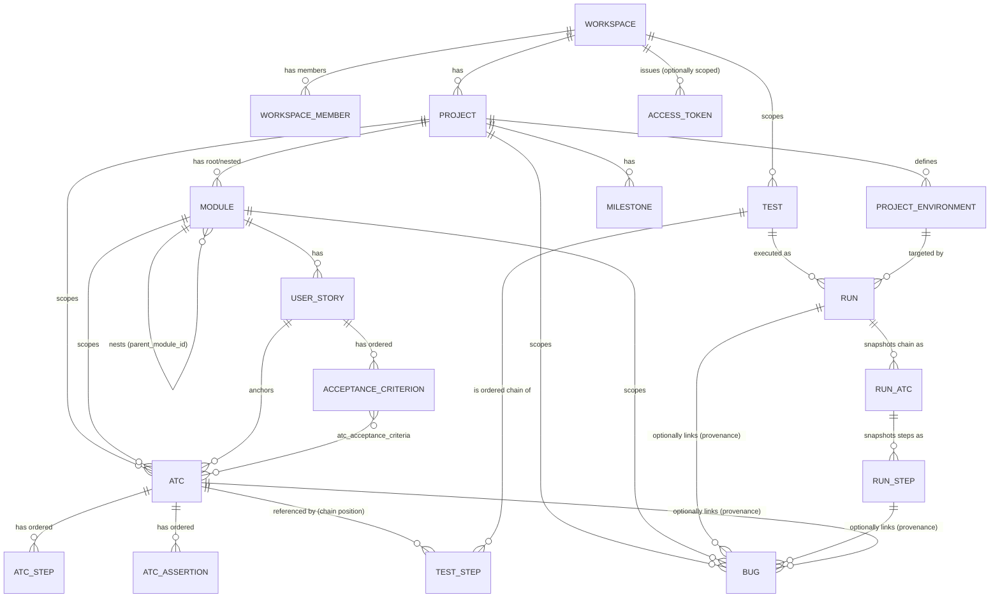
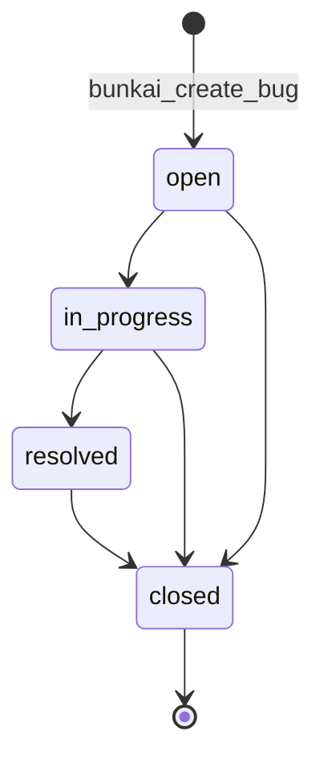
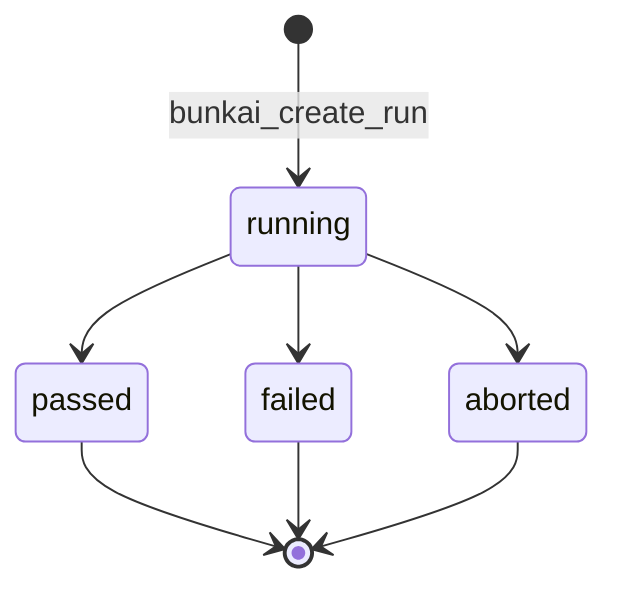

# Domain Glossary — Bunkai (discovered)

> Target repo: `upex-bunkai-tms`. Derived from the Postgres/Supabase migrations under `supabase/migrations/` (preferred over any ORM model, per discovery doctrine — this project has no ORM; migrations ARE the schema). Cross-checked against `lib/*/validation.ts` files where present.
> Generated: 2026-08-17 — Phase 1, sub-step 4 (`/project-discovery`).

---

## Core Entities

### Workspace

The multi-tenant root. Every other entity resolves back to a Workspace, directly or transitively.

| Technical Name | Business Name | Description | Table/Collection | Key Attributes | Found In |
|---|---|---|---|---|---|
| `workspace` | Workspace / Tenant | The billing + isolation boundary. One org/team = one workspace (single-project tenancy for MVP). | `public.workspaces` | `id`, `slug` (unique), `name`, `owner_user_id`, `plan` (`community`\|`cloud`\|`enterprise`) | `upex-bunkai-tms/supabase/migrations/0001_tenancy.sql:27-35` |

Relationships:
- Has many `workspace_members` (join to `auth.users`, with `role`/`status`)
- Has many `Project`
- Has many `Test` (Tests are workspace-scoped, not project-scoped — see Test entity)
- Has many `access_tokens` (PATs, optionally workspace-scoped or global)

```json
{
  "id": "b1a2c3d4-...",
  "slug": "upex-galaxy",
  "name": "UPEX Galaxy",
  "owner_user_id": "u1...",
  "plan": "community",
  "created_at": "2026-05-19T00:00:00Z"
}
```

### Project

The "application under test" being managed inside a Workspace.

| Technical Name | Business Name | Description | Table/Collection | Key Attributes | Found In |
|---|---|---|---|---|---|
| `project` | Project | A distinct product/app tracked for QA purposes. Scoped to exactly one Workspace. | `public.projects` | `id`, `workspace_id`, `slug` (unique per workspace), `name`, `description` | `upex-bunkai-tms/supabase/migrations/0002_projects_modules.sql:17-25` |

Relationships:
- Belongs to `Workspace`
- Has many `Module` (root modules; modules self-nest below)
- Has many `ATC` (ATCs are project-scoped, unlike Tests which are workspace-scoped)
- Has many `Bug`, `Milestone`, `Project Environment`

```json
{
  "id": "p1...",
  "workspace_id": "b1a2c3d4-...",
  "slug": "bunkai-web",
  "name": "Bunkai Web App",
  "description": "The core Next.js application"
}
```

### Module

A self-referential tree node used to partition a Project's features/areas. Enforces a bounded depth so tree-view rendering stays predictable.

| Technical Name | Business Name | Description | Table/Collection | Key Attributes | Found In |
|---|---|---|---|---|---|
| `module` | Module | A feature area / folder in the test-authoring tree. Can nest inside another Module up to depth 6. | `public.modules` | `id`, `project_id`, `parent_module_id` (nullable, self-FK), `path` (materialized, slash-separated, unique per project), `name`, `position` | `upex-bunkai-tms/supabase/migrations/0002_projects_modules.sql:109-121` |

Relationships:
- Belongs to `Project`
- Belongs to parent `Module` (nullable — root modules have `parent_module_id = null`)
- Has many child `Module`
- Has many `User Story`, `ATC`, `Bug`

Business rule enforced structurally: `constraint modules_path_depth_max_6 check (array_length(string_to_array(path, '/'), 1) between 1 and 6)` — Found in: `upex-bunkai-tms/supabase/migrations/0002_projects_modules.sql:118-120`.

```json
{
  "id": "m1...",
  "project_id": "p1...",
  "parent_module_id": null,
  "path": "checkout",
  "name": "Checkout",
  "position": 0
}
```

### User Story (+ Acceptance Criterion)

The unit of business intent that every ATC must anchor to. Modeled as two tables because a Story has N ordered Acceptance Criteria.

| Technical Name | Business Name | Description | Table/Collection | Key Attributes | Found In |
|---|---|---|---|---|---|
| `user_story` | User Story | A requirement statement, optionally synced from an external tracker (Jira). | `public.user_stories` | `id`, `module_id`, `title`, `description`, `external_id`, `external_url` | `upex-bunkai-tms/supabase/migrations/0003_authoring.sql:15-23` |
| `acceptance_criterion` | Acceptance Criterion (AC) | One testable condition of a User Story. Ordered within the story. | `public.acceptance_criteria` | `id`, `user_story_id`, `title`, `description`, `position` (unique per story) | `upex-bunkai-tms/supabase/migrations/0003_authoring.sql:122-130` |

Relationships:
- `User Story` belongs to `Module`; has many `Acceptance Criterion`; has many `ATC` (direct FK, `atcs.user_story_id`)
- `Acceptance Criterion` belongs to `User Story`; has many `ATC` via `atc_acceptance_criteria` (M:N)
- `external_id`/`external_url` on `user_stories` corroborate the Jira-import feature (`lib/jira/import-runner.ts`, `lib/jira/extract-acceptance-criteria.ts`)

```json
{
  "id": "us1...",
  "module_id": "m1...",
  "title": "As a shopper, I can complete checkout with a saved card",
  "external_id": "BK-42",
  "external_url": "https://upexgalaxy71.atlassian.net/browse/BK-42"
}
```

### ATC (Acceptance Test Case)

The atomic, reusable unit of verification — Bunkai's core differentiator (see `business-model.md` §1/§4). Bound to exactly one User Story (direct FK) and at least one Acceptance Criterion (M:N, enforced at the application layer per the migration's own comment, made structural by FK).

| Technical Name | Business Name | Description | Table/Collection | Key Attributes | Found In |
|---|---|---|---|---|---|
| `atc` | ATC (Acceptance Test Case) | A reusable, atomic test case. Has ordered Steps and Assertions. Searchable via full-text `tsv`. | `public.atcs` | `id`, `project_id`, `module_id`, `user_story_id`, `slug` (unique per project), `title`, `layer` (`UI`\|`API`\|`Unit`), `version`, `status`, `tags[]` | `upex-bunkai-tms/supabase/migrations/0004_atcs.sql:53-69` |
| `atc_step` | ATC Step | One ordered step of an ATC (action + optional input data + expected result). | `public.atc_steps` | `id`, `atc_id`, `position` (unique per ATC), `content`, `input_data`, `expected` | `upex-bunkai-tms/supabase/migrations/0004_atcs.sql:179-187` |
| `atc_assertion` | ATC Assertion | One ordered assertion/check of an ATC, separate from steps. | `public.atc_assertions` | `id`, `atc_id`, `position` (unique per ATC), `content` | `upex-bunkai-tms/supabase/migrations/0004_atcs.sql:285-291` |

Relationships:
- Belongs to `Project`, `Module`, `User Story` (all direct FK)
- Bound to ≥1 `Acceptance Criterion` via `atc_acceptance_criteria` (M:N)
- Has many `ATC Step`, `ATC Assertion`
- Referenced by `Test` via `test_steps.atc_id` (a Test is a chain of ATC references, not copies)

```json
{
  "id": "atc1...",
  "project_id": "p1...",
  "module_id": "m1...",
  "user_story_id": "us1...",
  "slug": "checkout-saved-card-happy-path",
  "title": "Complete checkout using a saved card",
  "layer": "UI",
  "status": "unrun",
  "tags": ["checkout", "payments"]
}
```

### Test

A named, ordered chain of ATC references. Workspace-scoped (not project-scoped), unlike ATCs — Found in migration comment: "Tests are workspace-scoped (unlike project-scoped atcs) and bind to exactly one workspace at save-commit time" (`upex-bunkai-tms/supabase/migrations/0024_tests.sql:6-7`).

| Technical Name | Business Name | Description | Table/Collection | Key Attributes | Found In |
|---|---|---|---|---|---|
| `test` | Test | A container owning an ordered chain of ATC references. | `public.tests` | `id`, `workspace_id`, `title` (1-200 chars, trimmed), `created_by` | `upex-bunkai-tms/supabase/migrations/0024_tests.sql:40-49` |
| `test_step` | Test Step (chain position) | One position in a Test's ATC chain. The same ATC may repeat at multiple positions (deliberately no unique constraint on `(test_id, atc_id)`). | `public.test_steps` | `id`, `test_id`, `atc_id` (`on delete restrict`), `position` (unique per test, ≥1) | `upex-bunkai-tms/supabase/migrations/0024_tests.sql:60-68` |

Relationships:
- Belongs to `Workspace`
- Has many `Test Step`, each referencing one `ATC`
- Has many `Run` (each Run executes one Test)

```json
{
  "id": "t1...",
  "workspace_id": "b1a2c3d4-...",
  "title": "Checkout regression suite — happy paths",
  "created_by": "u1..."
}
```

### Run

An executable instance of a Test against a specific Project Environment. Snapshots the chain at start time (`run_atcs`, `run_steps`) so later edits to the source Test/ATCs don't retroactively change historical run records.

| Technical Name | Business Name | Description | Table/Collection | Key Attributes | Found In |
|---|---|---|---|---|---|
| `project_environment` | Project Environment | A named target environment a Run executes against (e.g. Staging, Production). Seeded per project. | `public.project_environments` | `id`, `project_id`, `name` (unique per project, case-insensitive) | `upex-bunkai-tms/supabase/migrations/0031_runs.sql:30-39` |
| `run` | Run | One execution attempt of a Test. | `public.runs` | `id`, `workspace_id`, `project_id`, `test_id`, `environment_id`, `status`, `executor_mode` (`human`\|`agent`\|`ci`), `executor_user_id`, `test_title` (snapshot), `started_at`, `finished_at` | `upex-bunkai-tms/supabase/migrations/0031_runs.sql:72-90` |
| `run_atc` | Run ATC (snapshot) | Snapshot of one chain position at run start. | `public.run_atcs` | `id`, `run_id`, `atc_id` (provenance only, `set null`), `position`, `atc_title` (snapshot), `status` | `upex-bunkai-tms/supabase/migrations/0031_runs.sql:120-129` |
| `run_step` | Run Step (snapshot) | Snapshot of one executable step at run start. | `public.run_steps` | `id`, `run_atc_id`, `atc_step_id` (provenance only), `position`, `content` (snapshot) | `upex-bunkai-tms/supabase/migrations/0031_runs.sql:163-170` |

Relationships:
- `Run` belongs to `Workspace`, `Project`, `Test`, `Project Environment`
- `Run` has many `Run ATC` (ordered snapshot of the Test's chain)
- `Run ATC` has many `Run Step`
- `Bug` may optionally reference a `Run`, `Run Step`, and `ATC` as provenance (see Bug entity)

```json
{
  "id": "r1...",
  "workspace_id": "b1a2c3d4-...",
  "project_id": "p1...",
  "test_id": "t1...",
  "environment_id": "e1...",
  "status": "running",
  "executor_mode": "human",
  "test_title": "Checkout regression suite — happy paths",
  "started_at": "2026-08-17T10:00:00Z"
}
```

### Bug

A defect record, optionally provenance-linked to the Run/Step/ATC that surfaced it, or filed standalone. The migration comment notes the TMS-native term is "bug" while Jira-facing prose says "defect" — same entity, different vocabulary per audience (see Terminology Mapping below).

| Technical Name | Business Name | Description | Table/Collection | Key Attributes | Found In |
|---|---|---|---|---|---|
| `bug` | Bug (a.k.a. Defect in Jira-facing text) | A defect record anchored to a Module, optionally to a Run/Run Step/ATC as provenance. | `public.bugs` | `id`, `workspace_id`, `project_id`, `module_id` (always populated), `run_id`/`run_step_id`/`atc_id` (nullable provenance), `title` (5-200 chars), `severity` (`P1`\|`P2`\|`P3`\|`P4`), `status` (`open`\|`in_progress`\|`resolved`\|`closed`), `description`, `steps_to_reproduce` | `upex-bunkai-tms/supabase/migrations/0046_bugs.sql:93-110` |

Relationships:
- Belongs to `Workspace`, `Project`, `Module` (mandatory)
- Optionally provenance-linked to `Run`, `Run Step`, `ATC` (all nullable, `on delete set null` — provenance survives deletion of the source)

```json
{
  "id": "bug1...",
  "workspace_id": "b1a2c3d4-...",
  "project_id": "p1...",
  "module_id": "m1...",
  "run_id": "r1...",
  "run_step_id": "rs1...",
  "atc_id": "atc1...",
  "title": "Saved-card checkout fails with 500 on expired card",
  "severity": "P1",
  "status": "open"
}
```

### Milestone

A target-dated project checkpoint (planning entity, not directly part of the ATC→Test→Run→Bug execution chain).

| Technical Name | Business Name | Description | Table/Collection | Key Attributes | Found In |
|---|---|---|---|---|---|
| `milestone` | Milestone | A named, target-dated checkpoint for a Project. | `public.milestones` | `id`, `workspace_id`, `project_id`, `name` (unique per project, case-insensitive, 1-100 chars), `target_date`, `description` (≤500 chars), `created_by` | `upex-bunkai-tms/supabase/migrations/0064_milestones.sql:44-56` |

Relationships:
- Belongs to `Workspace`, `Project`

```json
{
  "id": "ms1...",
  "workspace_id": "b1a2c3d4-...",
  "project_id": "p1...",
  "name": "Q3 Release",
  "target_date": "2026-09-30",
  "description": "Feature-complete checkpoint for the Q3 release"
}
```

### Access Token (PAT)

Not a "business" entity in the QA sense, but core to the API-first value proposition — governs headless/CI/AI-agent access.

| Technical Name | Business Name | Description | Table/Collection | Key Attributes | Found In |
|---|---|---|---|---|---|
| `access_token` | Personal Access Token (PAT) | A bearer credential for headless callers (CLI, CI, AI agents). Raw secret shown once at issuance; only its hash is stored. | `public.access_tokens` | `id`, `user_id`, `workspace_id` (nullable = global token), `token_prefix`, `hash`, `scopes[]` (subset of `atc:read`, `atc:write`, `run:execute`, `workspace:admin`), `expires_at`, `revoked_at` | `upex-bunkai-tms/supabase/migrations/0008_access_tokens.sql:21-36` |

Relationships:
- Belongs to a `user` (`auth.users`); optionally scoped to one `Workspace`

```json
{
  "id": "pat1...",
  "user_id": "u1...",
  "workspace_id": null,
  "token_prefix": "bk_pat_abc123",
  "scopes": ["atc:read", "run:execute"],
  "expires_at": null,
  "revoked_at": null
}
```

---

## Enumerations and Constants

| Value | Business Meaning | Usage Context | Found In |
|---|---|---|---|
| `workspaces.plan`: `community` \| `cloud` \| `enterprise` | Billing tier (modeled, not yet gated by billing logic per this discovery pass) | Workspace row default `community` | `upex-bunkai-tms/supabase/migrations/0001_tenancy.sql:32-33` |
| `workspace_members.role`: `viewer` \| `member` \| `admin` \| `owner` | RBAC role within a workspace. `viewer` is read-only; `member`+ can write; `admin`/`owner` manage membership | Gates every RLS write policy observed | `upex-bunkai-tms/supabase/migrations/0001_tenancy.sql:43-44` |
| `workspace_members.status`: `active` \| `invited` \| `suspended` | Membership lifecycle state. Only `active` members pass RLS checks | RLS `using` clauses across all tables | `upex-bunkai-tms/supabase/migrations/0001_tenancy.sql:45-46` |
| `atcs.layer`: `UI` \| `API` \| `Unit` | Which test layer/pyramid level the ATC targets | ATC creation/filtering | `upex-bunkai-tms/supabase/migrations/0004_atcs.sql:60` |
| `atcs.status`: `pass` \| `fail` \| `blocked` \| `skipped` \| `running` \| `unrun` | Last-known result status of the ATC (independent of any specific Run) | ATC library list/filter | `upex-bunkai-tms/supabase/migrations/0004_atcs.sql:62-63` |
| `runs.status`: `running` \| `passed` \| `failed` \| `aborted` | Overall Run verdict | Run header, drives dashboards | `upex-bunkai-tms/supabase/migrations/0031_runs.sql:79-80` |
| `runs.executor_mode`: `human` \| `agent` \| `ci` | Who/what drove the Run | Run creation; distinguishes manual UI runs from API-driven runs | `upex-bunkai-tms/supabase/migrations/0031_runs.sql:81` |
| `run_atcs.status`: `pending` \| `passed` \| `failed` \| `blocked` \| `skipped` | Per-chain-position result within a Run | Runner UI step marking | `upex-bunkai-tms/supabase/migrations/0031_runs.sql:126-127` |
| `bugs.severity`: `P1` \| `P2` \| `P3` \| `P4` | Defect severity, P1 = most severe | Bug filing form, heatmap weighting | `upex-bunkai-tms/supabase/migrations/0046_bugs.sql:106` |
| `bugs.status`: `open` \| `in_progress` \| `resolved` \| `closed` | Defect lifecycle state | Bug triage / Kanban-style views | `upex-bunkai-tms/supabase/migrations/0046_bugs.sql:107-108` |
| `access_tokens.scopes[]`: `atc:read` \| `atc:write` \| `run:execute` \| `workspace:admin` | Fine-grained PAT permission scopes (subset allowed, ≥1 required) | PAT issuance form, bearer-auth middleware | `upex-bunkai-tms/supabase/migrations/0008_access_tokens.sql:29-32` |

## Business Rules

### BR-1 — Module tree depth is capped at 6

- **Description**: A Module's materialized `path` (slash-separated ancestor chain) may contain at most 6 segments.
- **Entities Affected**: `Module`
- **Validation**: `check (array_length(string_to_array(path, '/'), 1) between 1 and 6)`
- **Error Message**: not directly observed in this pass (DB-level constraint violation; application-layer message not traced) — Discovery Gap.
- **Found In**: `upex-bunkai-tms/supabase/migrations/0002_projects_modules.sql:118-120`
- **Given/When/Then**: Given a Module already at depth 6, When a user attempts to create a child Module beneath it, Then the insert is rejected at the database layer by the depth-6 CHECK constraint.

### BR-2 — An ATC must anchor to a User Story and ≥1 Acceptance Criterion

- **Description**: `atcs.user_story_id` is a mandatory FK (`on delete restrict`); every ATC must additionally be linked to at least one Acceptance Criterion via `atc_acceptance_criteria`. The migration comment states this M:N minimum is enforced at the application layer, "made structural by FK" for the direct User Story link.
- **Entities Affected**: `ATC`, `User Story`, `Acceptance Criterion`
- **Validation**: `atcs.user_story_id not null references user_stories(id) on delete restrict`; `atc_acceptance_criteria` M:N join, application-layer minimum-1 check (not independently traced to a specific validation function in this pass — Discovery Gap on the exact application-layer guard location).
- **Found In**: `upex-bunkai-tms/supabase/migrations/0004_atcs.sql:1-15, 57, 389-393`
- **Given/When/Then**: Given a User Story with zero Acceptance Criteria, When a user attempts to create an ATC under that story, Then the ATC creation should be rejected (application-layer rule — exact enforcement point not verified in this pass).

### BR-3 — A Test's ATC chain must contain at least one ATC, and every ATC must belong to the target workspace

- **Description**: The `bunkai_create_test` RPC validates (in order): role gate → title 1-200 chars trimmed → chain has ≥1 ATC → every distinct ATC id resolves inside the target workspace (foreign-workspace/nonexistent/NULL ids collapse into one uniform error, described in the migration as "INV-3 non-disclosure" — deliberately not revealing which specific ids were invalid, to avoid leaking cross-tenant existence information).
- **Entities Affected**: `Test`, `Test Step`, `ATC`
- **Validation**: custom SQLSTATE codes `45120` (chain must contain ≥1 ATC), `45121` (title length), `45122` (cross-workspace/invalid ATC ids)
- **Found In**: `upex-bunkai-tms/supabase/migrations/0024_tests.sql:24-31`
- **Given/When/Then**: Given a Test-creation request whose ATC chain includes an ATC id from a different workspace, When `bunkai_create_test` is invoked, Then the RPC raises SQLSTATE `45122` without disclosing which specific id(s) were invalid.

### BR-4 — A Bug's provenance links (Run/Run Step/ATC) must all belong to the same Project as the Bug

- **Description**: `bunkai_create_bug` validates that `p_module_id` belongs to `p_project_id`, and — per a documented adversarial-review fix — that `p_run_id`/`p_run_step_id`/`p_atc_id` also belong to the same project, closing a cross-tenant provenance-injection gap found during review.
- **Entities Affected**: `Bug`, `Module`, `Run`, `Run Step`, `ATC`
- **Validation**: custom SQLSTATE codes `45300`–`45307` (module-outside-project, title/severity/evidence backstops, project-outside-workspace, run/run-step/ATC-outside-project)
- **Found In**: `upex-bunkai-tms/supabase/migrations/0046_bugs.sql:38-87`
- **Given/When/Then**: Given a write-role member of Project A, When they call `bunkai_create_bug` directly (bypassing the HTTP route) with a `p_run_id` belonging to Project B, Then the RPC raises SQLSTATE `45305` (`bugs_run_outside_project`).

### BR-5 — Milestone target-date bounds are write-time only, not a standing row invariant

- **Description**: A Milestone's `target_date` must be today-or-later and within 5 years, but only checked in the RPC body at write time (when the date value actually changes) — deliberately NOT a table CHECK constraint, because a CHECK re-validates on every later update, which would make a milestone valid on creation become permanently un-editable once its date passed.
- **Entities Affected**: `Milestone`
- **Validation**: RPC-level guard (SQLSTATE `45502` past date, `45503` too far out), fires only when `p_target_date is distinct from` the stored value
- **Found In**: `upex-bunkai-tms/supabase/migrations/0064_milestones.sql:9-18`
- **Given/When/Then**: Given a Milestone whose `target_date` is now in the past, When a user edits only its `description` (not the date), Then the edit succeeds — the past-date rule does not re-fire because the date itself didn't change.

## Entity Relationships Diagram



## Terminology Mapping

### Technical -> Business terms

| Technical (code / DB) | Business term | Notes |
|---|---|---|
| `workspace` | Workspace / Tenant / Organization | Root tenant boundary |
| `project` | Project | The app-under-test |
| `module` | Module | Feature area, tree node |
| `user_story` | User Story | Requirement statement |
| `acceptance_criterion` | Acceptance Criterion (AC) | Testable condition of a Story |
| `atc` | ATC / Acceptance Test Case | The core reusable test-case unit |
| `test` | Test | An ordered chain of ATCs |
| `run` | Run | One execution attempt of a Test |
| `bug` | Bug (TMS-native) / Defect (Jira-facing prose) | Same entity — vocabulary differs by audience, per `upex-bunkai-tms/supabase/migrations/0046_bugs.sql:3-4` |
| `milestone` | Milestone | Target-dated project checkpoint |
| `access_token` | Personal Access Token (PAT) | Headless/API credential |
| `workspace_members.role` | Role (Viewer/Member/Admin/Owner) | RBAC level |

### Abbreviations and acronyms

| Abbreviation | Expansion | Found In |
|---|---|---|
| ATC | Acceptance Test Case | `upex-bunkai-tms/supabase/migrations/0004_atcs.sql:1`, `.context/PRD/executive-summary.md` |
| AC | Acceptance Criterion | `upex-bunkai-tms/supabase/migrations/0003_authoring.sql:5` |
| PAT | Personal Access Token | `upex-bunkai-tms/supabase/migrations/0008_access_tokens.sql:1` |
| RLS | Row-Level Security (Postgres/Supabase) | Present on every table across all migrations reviewed |
| TMS | Test Management System | `upex-bunkai-tms/.context/PRD/executive-summary.md:3` |
| BK | Jira project key for this project ("Bunkai") | `upex-bunkai-tms/.agents/project.yaml:12` |
| ADR | Architecture Decision Record | `upex-bunkai-tms/.context/ADR/` |

## Status / State Flows

### Bug status


Found in: `bugs.status text not null default 'open' check (status in ('open','in_progress','resolved','closed'))` — `upex-bunkai-tms/supabase/migrations/0046_bugs.sql:107-108`. **Discovery Gap**: the exact set of *permitted transitions* (e.g. can `open` go directly to `closed`?) was not independently verified against a state-machine guard function in this pass — the diagram above assumes an unrestricted lattice over the 4 known values, which may be stricter in practice (a `transition-bug-status-isolation.test.ts` file exists at `upex-bunkai-tms/lib/bugs/transition-bug-status-isolation.test.ts`, suggesting transition rules ARE tested, but the rule set itself was not read in this Phase-1 pass).

### Run status


Found in: `runs.status text not null default 'running' check (status in ('running','passed','failed','aborted'))` — `upex-bunkai-tms/supabase/migrations/0031_runs.sql:79-80`, corroborated by migration filenames `0036_run_abort.sql` and `0037_run_finish.sql` (dedicated migrations for the abort and finish transitions).

## UI Labels Reference

**Discovery Gap** — no i18n/locale directory was found in the target repo (`find upex-bunkai-tms -iname "*locale*" -o -iname "*i18n*"` returned nothing), meaning UI copy is authored directly in component JSX rather than extracted to translation files. Per discovery doctrine, hardcoded component strings are a lower-confidence source than shipped i18n bundles and were **not** transcribed into this glossary from JSX to avoid over-claiming precision on exact button/field copy. A dedicated pass through `components/{atcs,tests,runs,bugs,milestones}/` would be needed to build a verified form-field and action-button label table — recommended for Phase 3 (Frontend Discovery) rather than this Phase 1 pass.

## Discovery Gaps

- [ ] Exact application-layer enforcement point for "ATC must have ≥1 Acceptance Criterion" (BR-2) — the FK to User Story is structural, but the AC-minimum-1 rule's exact guard (RPC check? Zod schema? both?) was not traced to a specific file/line in this pass.
- [ ] Full permitted bug-status transition table (BR referenced above) — a dedicated isolation test file exists (`lib/bugs/transition-bug-status-isolation.test.ts`) implying real transition rules exist beyond the raw CHECK constraint, but they weren't read in this pass.
- [ ] `notifications` and `notification_preferences` tables exist (`supabase/migrations/0053_notifications.sql`, `0062_notification_preferences.sql`) but were not schema-read in this Phase 1 pass — deferred as a lower-priority entity for a later phase.
- [ ] `import_jobs` table (`0019_import_jobs.sql`) — Jira-import job tracking — not schema-read in this pass; relevant to QA test planning for the import feature but out of scope for Phase 1's 5-entity minimum.
- [ ] UI label copy (see "UI Labels Reference" above) — deferred to Phase 3.
- [ ] Whether `workspace_members.role = 'viewer'` maps to a distinct "Developer" persona named in the target's PRD, or whether developers use `member` role — not resolved from schema alone (the schema only names `viewer/member/admin/owner`, not a role called "developer").

## QA Usage Guide

- **Naming test cases**: use the Business Name column (ATC, Test, Run, Bug, Milestone, Workspace, Project, Module, User Story, Acceptance Criterion) consistently — do not invent synonyms. When Jira-facing artifacts must say "Defect" instead of "Bug", that's an intentional audience-vocabulary switch (see Terminology Mapping), not a different entity.
- **State-based test design**: `runs.status` and `bugs.status` are the two confirmed state machines in this schema — both are BVA/State-Transition technique triggers per this repo's `test-design-doctrine.md`. Treat the Run state diagram as higher-confidence (corroborated by dedicated `run_abort`/`run_finish` migrations) than the Bug state diagram (transition rules not yet independently verified — see Discovery Gaps).
- **Isolation/RLS test parity**: the target repo already names a large fraction of its own unit tests `*-isolation.test.ts` (cross-tenant RLS checks). QA's own test plan should treat cross-workspace isolation as an explicit, named test category — mirroring the target's own convention — rather than folding it into generic negative-path testing.
- **Provenance-nullable fields are not "optional as in unimportant"**: `bugs.run_id`/`run_step_id`/`atc_id` being nullable reflects the standalone-bug-filing path, not laxity — BR-4 shows real, tested cross-project validation exists on these fields. Do not treat them as low-risk just because they're nullable.
- **Anchoring chain drives negative-test design**: the ATC → User Story (`restrict`) and Test Step → ATC (`restrict`) foreign keys mean "delete a still-referenced parent" is a first-class negative-test scenario across this schema, not a one-off edge case.
